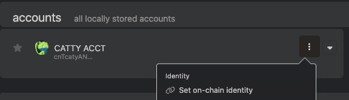
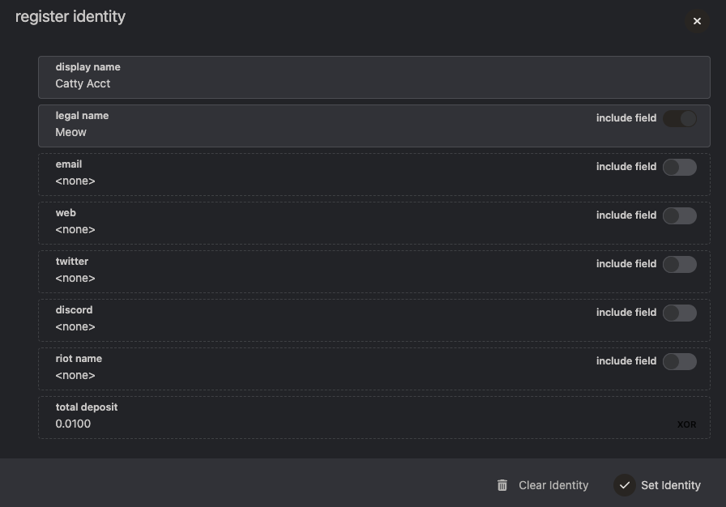
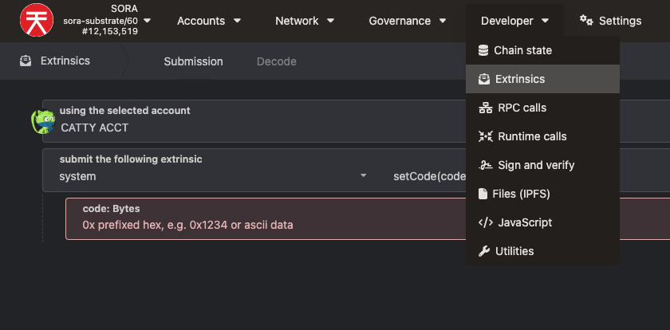
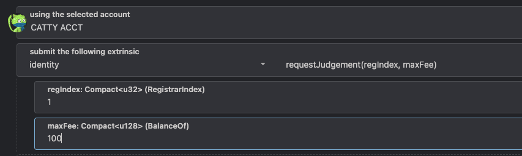

# Requesting Identity Judgement

## TL;DR

- You can set an on-chain identity to make it easier for others to recognize your address.
- As a Validator, it adds extra confidence to Nominators if they know your on-chain identity.
- This tutorial will help you set up an on-chain identity and request a judgement to your identity (as a trusted or verified entity on the SORA network)

## 1. Setting an On-Chain Identity

1.  To do this, click the 3 vertical dots next to your account on
    Polkadot.js and select `Set on-chain identity`.

2. Add the details you wish to be public and click `Set identity`.

 3. A deposit of 0.01XOR is required.

## 2. Request Judgement from a Registrar

1. On polkadot.js, under the Developer tab, click Extrinsics.

2. Using the account you wish to be verified, select `Identity` and
   `requestJudgement` then, under `regIndex`, place `1` (`reg_index 0` is no
   longer active), and under `maxFee` input `100`. The registrar fee is
   100 XOR, excluding the transaction fee.

3. Submit the transaction.

## 3. Donate to the Community Marketing Funds Address

Donate a minimum of 5 XSTUSD per account requesting judgement to the
Community Marketing Funds address.

`cnSN9X2HNU3uYjRbGvTwpgUdtVDuNk1g29XkcQNoNBQxgt1ii`

:::info
This is a community base wallet which funds are used for marketing SORA.
:::

## 4. Contact the Registrar

- Direct contact with the registrar is required - the contact info is in their identity.
  `Reg_Index 1` is `SPICY`.
  You can contact the registrar on:
- Telegram - [SpicyHotWings ](https://t.me/SpicyHotWings)
- Twitter - [@mishokanaria](https://twitter.com/MishoKanaria)
- Riot (Matrix) - [spicyhotwings](https://matrix.to/#/@spicyhotwings:matrix.org)

## 5. Verify your Identity

You will need to prove that the information on-chain is legitimate.
Each registrar will have their own set of procedures to verify your identity and values, and only once you've satisfied their requirements will the process continue.

:::info
Note that changing even a single field's value after you've been
verified will un-verify your account and you will need to start the
judgement process anew. However, you can still change fields while the
judgement is ongoing - it's up to the registrar to keep an eye on the changes.
:::

## Learn More

- [Create an Account on SORA](/create-an-address.md)
- [Running a SORA Node](/running-a-node.md)
