# Social recovery

## Overview

The Recovery pallet serves as an M-of-N social recovery tool that allows users to regain access to their accounts in case of lost private keys or other authentication methods. With this pallet, users can make calls on behalf of another account that they have recovered. The recovery process is secured by trusted "friends" chosen by the original account owner. To successfully recover an account, a threshold (M) out of N friends must approve the recovery process.

Please note that the official unmodified Parity pallet is utilized in this implementation. You can refer to the [official documentation](https://paritytech.github.io/substrate/master/pallet_recovery/index.html) for detailed information.

## Recovery Configuration

For each recoverable account, the account owner can configure the recovery process by specifying the following parameters:

- `friends`: A list of trusted friends who will safeguard the recovery process for the account.
- `threshold`: The minimum number of friends required to approve the recovery process for successful account recovery.
- `delay_period`: The minimum number of blocks that must elapse after initiating the recovery process before the account can be successfully recovered.
  A configurable deposit is required to create a recovery configuration. The deposit comprises a base deposit amount plus a multiplier based on the number of friends selected. When the account owner removes their recovery configuration, the deposit is fully refunded.

## Tutorial

The intended life cycle of a successful recovery follows these steps:

1. Suppose we intend to enable account recovery for the user named 'Alice'. In order to establish a recovery configuration for their account, the account owner initiates the `create_recovery` function call. If you are utilizing polkadot.js UI to configure the setup, you can follow these steps:

   - Go to 'Accounts' in the UI.
   - Navigate to the 'Accounts' tab.
   - Select the connected account for which you wish to create a recovery.
   - Click on the '...' option.
   - Choose the 'Make recoverable' option from the menu.
   - Fill the information

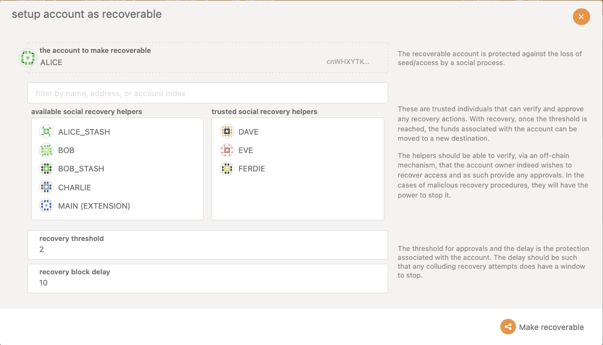

Once you press the 'Make recoverable' button, you will be able to view the details of the extrinsic being sent:

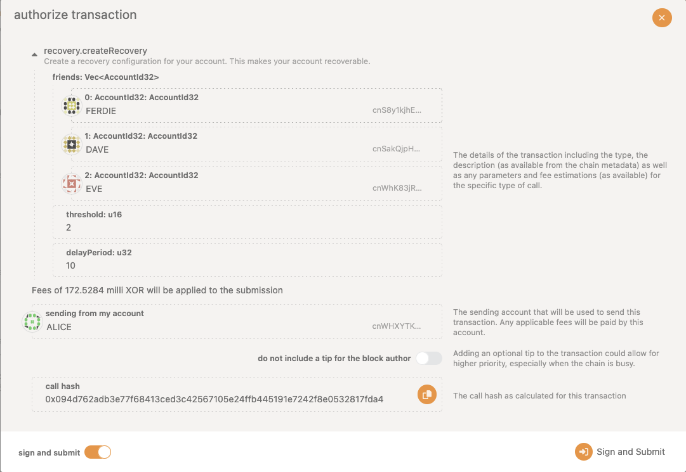

At a later time, if the account owner loses access to their account and wishes to recover it, they create a new account and fund it with sufficient balance for transaction fees and the recovery process deposit.

::: info
In the provided example, there are three friends indicated ('Dave', 'Eve', 'Ferdie'). To successfully claim the recovery, the account owner will need to obtain approvals from at least two out of these three friends and wait for 10 blocks.
:::

2. Using the new account, the account owner calls `initiate_recovery`.

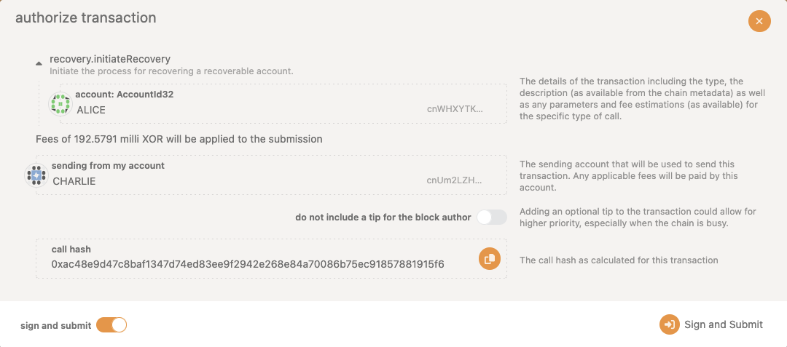

3. The account owner contacts their configured friends to vouch for the recovery attempt. They provide the old account ID and the new account ID, and friends call `vouch_recovery` with these parameters.

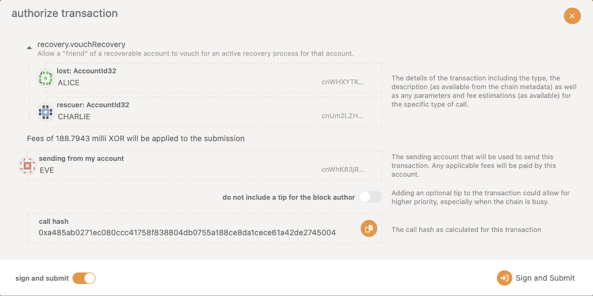

Once the threshold number of friends has vouched for the recovery attempt, the account owner must wait for the delay period to elapse, starting from when they initiated the recovery process.

4. The account owner can now call `claim_recovery`, which allows them to call `as_recovered` and make direct calls on behalf of the lost account.

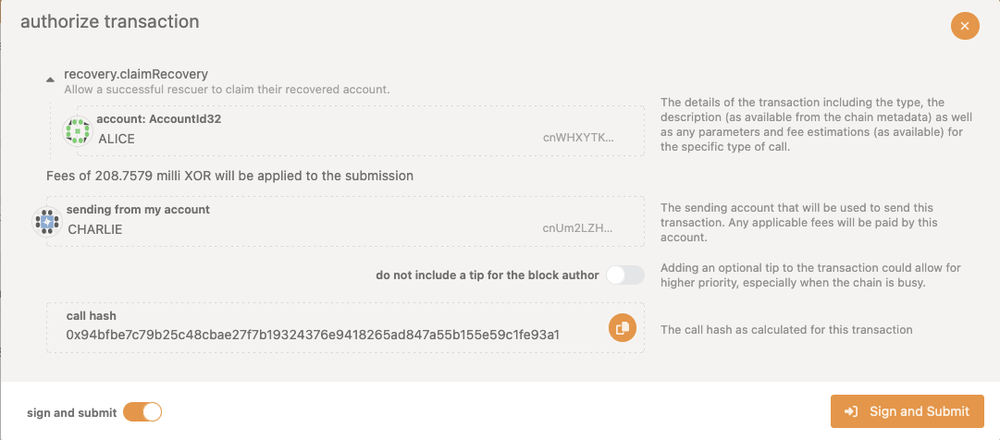

If the user meet the criteria for recoveries, they will see the following event:

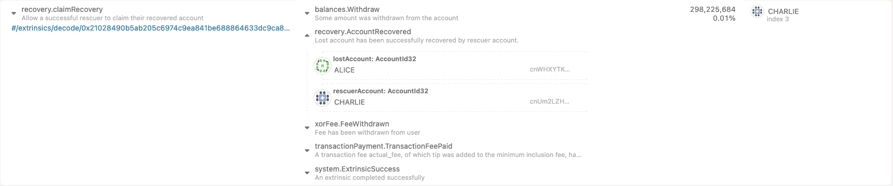

Alternatively, if there is an error, it will be indicated by an event.

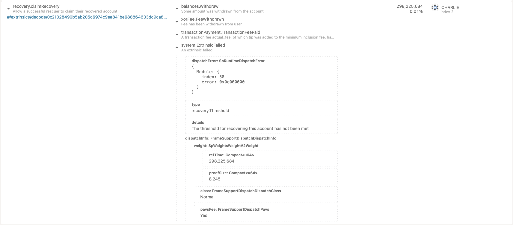

5. Using the recovered account, the account owner can call `close_recovery` to close the recovery process they initiated and reclaim the recovery deposit.

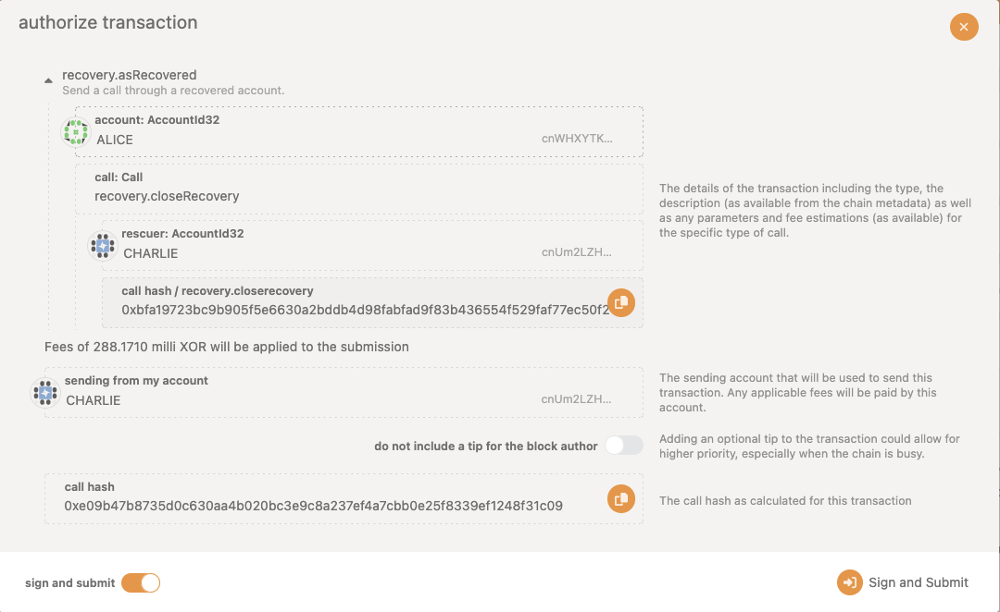

Subsequently, the corresponding event will follow:

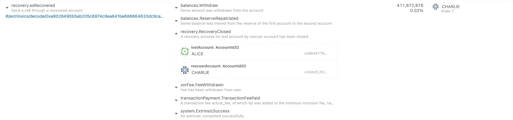

6. Then, the account owner should call `remove_recovery` to remove the recovery configuration on the recovered account and reclaim the recovery configuration deposit:

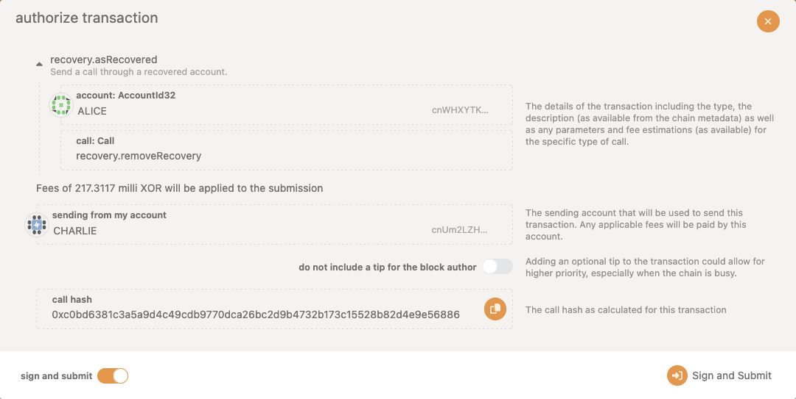

Subsequently, the corresponding event will follow:

7, Finally, using `as_recovered`, the account owner can call other pallets to clean up their state, reclaim any reserved or locked funds, and transfer all funds from the recovered account to the new account.

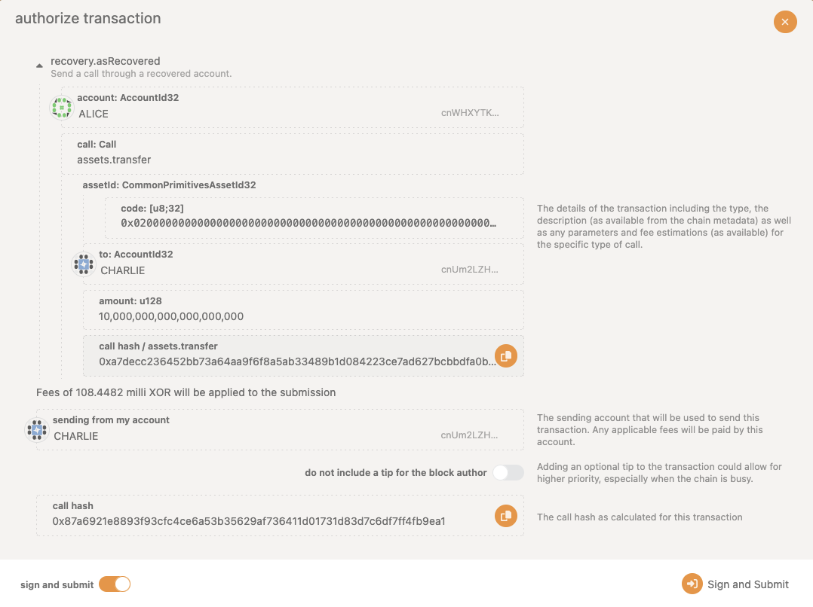

Subsequently, the corresponding event will follow:

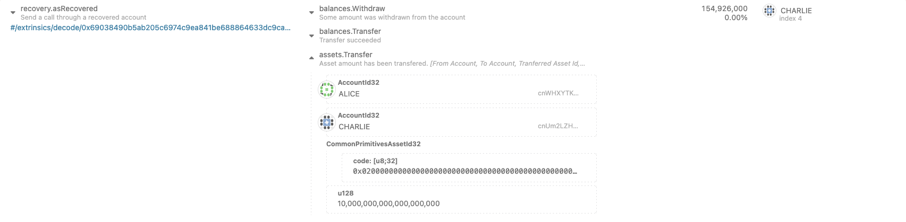

Once the recovered account's free and reserved balances drop to zero, the final recovery link is removed.

## Malicious Recovery Attempts

The recovery process can be initiated without permission, but the recovery deposit serves as an economic deterrent against malicious recovery attempts. In the case of a malicious attempt, the account owner who still has access to their account can claim the deposit and penalize the malicious user.

A successful malicious recovery attempt requires the attacker to obtain enough vouches from friends. If the account owner detects a malicious recovery process, they can easily reconfigure the recovery settings at minimal cost, replacing or removing friends who are acting inappropriately.

## Safety Considerations

It is essential to understand that this pallet can compromise the security of an account if used improperly. To ensure the secure usage of this pallet, consider the following recommendations:

Set a significant `delay_period` for the recovery process. This allows the account owner to monitor the blockchain periodically within the delay period to detect any unauthorized recovery attempts.
Choose a high threshold of approvals. A threshold of 1 means that any friend can recover the account by starting and approving their own recovery process. To prevent such attacks, select a high threshold and diverse friend group that cannot easily coordinate. Regularly update the recovery configuration as life circumstances and relationships change. Since the recovery configuration deposit is fully refundable, it is encouraged to update the configuration whenever necessary.
