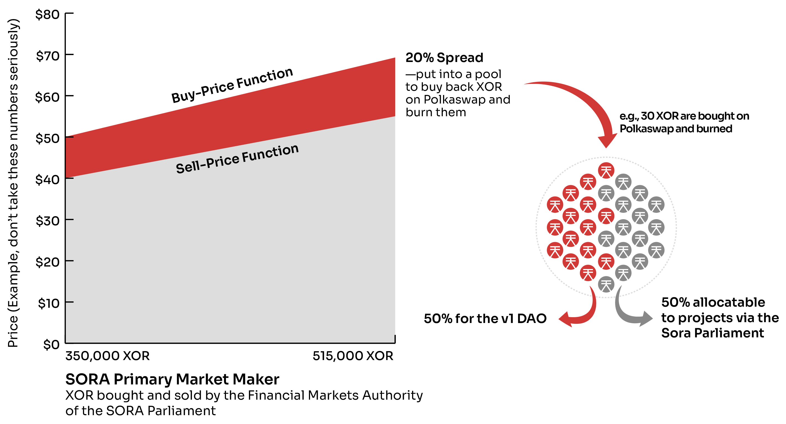
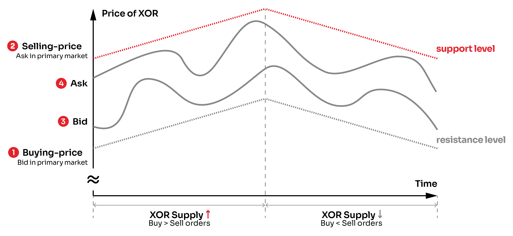
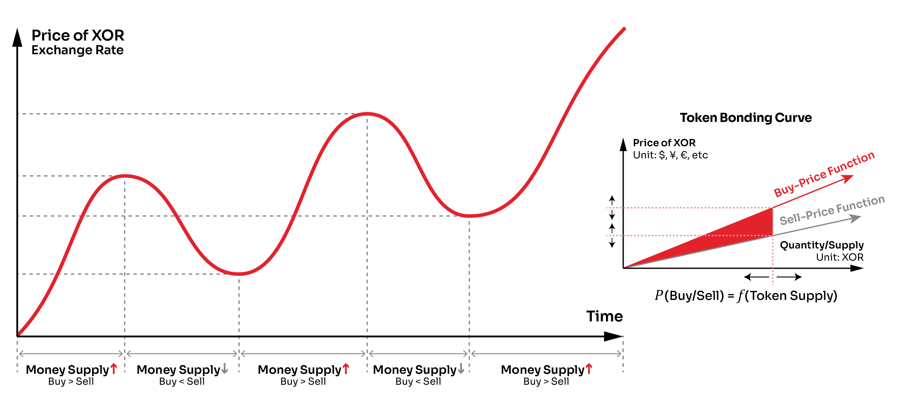
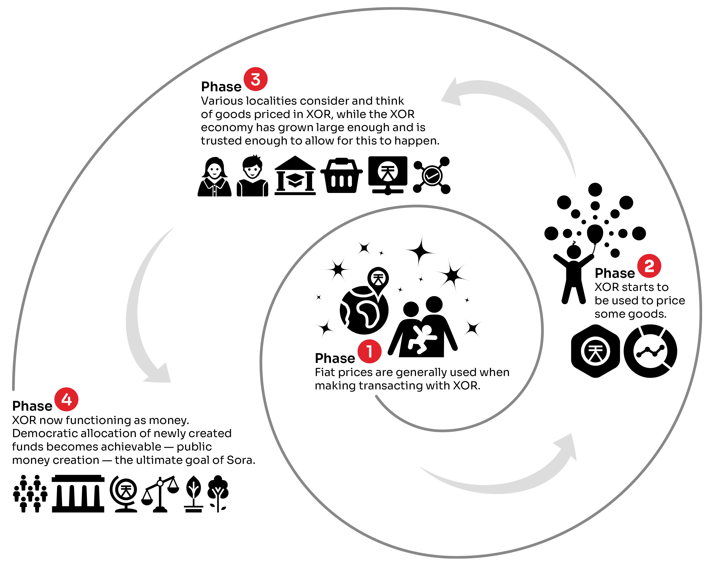

---
head:
  - - link
    - rel: stylesheet
      href: https://cdnjs.cloudflare.com/ajax/libs/KaTeX/0.5.1/katex.min.css
---

# SORA: The New Economic Order
- SORA v2 tokenomic model is proposed that uses a token bonding curve with an increasing price function. This means that as the token supply increases, the price also increases.
- Reserves held by the token bonding curve will provide liquidity for XOR.
- A new, staking reward token called VAL is proposed.
- ERC-20 XOR trading on Ethereum will be the initial supply of v2 XOR. ERC-20 XOR holders will also receive airdropped VAL.
- SORA v1 tokens are proposed to be converted into VAL.

## Background

On October 17, 2019, the [SORA](https://sora.org) v1 Network launched, issuing approximately 1,618,033,988 XOR. In March of 2020, approximately 350,000 XOR were moved from the SORA v1 Network to the Ethereum Network and [trading was started on Uniswap](http://sora.exchange). The goal of the initial launch on Uniswap was to perform preliminary price discovery and build the Sora community by incorporating users of the Ethereum network. However, our technology has improved, giving us the possibility to shape a new and more ambitious type of crypto ecosystem. Whereas our medium-term goal remains generating value for our community, our analysis of the SORA economy has **led us to embrace the long-term goal of realizing a supranational world economic system**.

To realize this system, we are proposing SORA: The New Economic Order. This is a profound and significant upgrade to the SORA Network and the SORA tokenomics. The [upgrade was voted on](https://medium.com/sora-xor/sora-new-economic-order-tokenomics-referendum-31581e8b649) and [ratified by the SORA community](https://medium.com/sora-xor/sora-v2-implementation-1febd3260b87). We feel that this is a system that can add value to humanity and we strongly support its adoption.

## SORAnomics

The key thesis of the SORA economic system is that **for cryptoeconomic systems to be able to compete with contemporary centralized economic systems, there needs to be a rational economic model**. To create a rational economic model, we did a survey of various economic theories, starting our journey in 2017. Over the course of this time we also employed an economist ([Yokei Yamaguchi](https://www.vollgeld-initiative.ch/fa/img/Vertiefung_deutsch/P2P-PM-System_WP__Japan_Futures_Research_Center.pdf)) to work with us in 2018, and he helped us with several key parts of the model.

The conclusions were that there is a large amount of empirical evidence that suggests that **it is the change in the allocation of money in an economy that is a necessary and sufficient determinant of growth**. This was shown by Richard Werner in his [disaggregated quantity theory of money](https://eprints.soton.ac.uk/36569/), where he disaggregated Fisher's [equation of exchange](https://en.wikipedia.org/wiki/Equation_of_exchange) (MV = PY; a good way to think about this is also that MV equals nominal GDP viewed from the perspective of buyers, whereas PY equates to nominal GDP viewed from the perspective of producers/sellers) into *real* (*R*) and *financial* (*F*) transactions:

$$
V_R\Delta M_R = \Delta(P_RY)
$$

$$
V_F\Delta M_F = \Delta(P_FQ_F)
$$

Where:

*V* := velocity of money

*M* := quantity of money

*P* := price index

*Y* := output of goods/services

*Q* := quantity demanded

It is helpful to think of the above equations as a dynamical system, such that if the quantity of money, *M*,  changes on the left-hand side of the equation, there must be some change on the right-hand side to balance out this change (this is because *V* is typically fairly stable in large economies). **For transactions in the real economy, this means that new money put into circulation is balanced out by new goods and services that consume this new purchasing power.** However, for financial transactions, there are no new goods or services being created with the new money put into circulation, so this causes a rise in asset prices to compensate (which is not what you want in your economic system). Additionally, it is also important to understand the importance of expanding M for the production of new goods and services. As [Shimomura wrote about extensively](https://www.jstage.jst.go.jp/article/economics1950/11/3-4/11_3-4_1/_article/-char/ja/) and Kurihara distilled to a simple, [linear programming model](https://books.google.co.jp/books?id=RVtGAQAAQBAJ&pg=PA60&lpg=PA60&dq=Japan%E2%80%99s+Credit-Supported+Growth+and+Linear+Programming&source=bl&ots=dNNHw-QyMh&sig=ACfU3U0gv9WNMZbWJBlfDf7AL5PY7aZzTQ&hl=ja&sa=X&ved=2ahUKEwjV8rf2qfHoAhUQx4sBHf2cBaEQ6AEwAHoECAwQKw#v=onepage&q=Japan%E2%80%99s%20Credit-Supported%20Growth%20and%20Linear%20Programming&f=false), expanding the quantity of money for new goods and services expands the economic output because latent resources (especially human resources) are mobilized, and existing resources are upgraded by the creation of new capital for production.

**What all this means is that for SORA to become a successful decentralized economy, we must create new tokens explicitly for creating new goods (like [wine](https://www.drinknoir.com)) or services (like [a really awesome DEX](https://polkaswap.io)).** While this has always been our goal, in v1 of the SORA economy there was the problem with liquidity, so that bootstrapping the economic system was slow and a new model was needed in order to have guarantees (or *[forward guidance](https://www.federalreserve.gov/faqs/what-is-forward-guidance-how-is-it-used-in-the-federal-reserve-monetary-policy.htm)*) about the liquidity and price of XOR so that projects could use the token successfully.

This is where the research of our economist Yamaguchi paid off again, as back in 2018, he suggested that we use a **token bonding curve** to autonomously manage the issuance and de-issuance of XOR in the economy. In other words, we found a way to manage the supply of tokens in a rational way, without involvement of humans, which will create a system that avoids the boom-bust problems of traditional economies and the deflationary economics of many cryptocurrencies.

## Token Bondage

A [token bonding curve](https://medium.com/coinmonks/token-bonding-curves-explained-7a9332198e0e) is a smart contract that takes as input some token and outputs a new token. There are a plethora of possible variations and this is an exciting area of research, but in SORA we use a simple model where there are two linear functions: a buy-price function and a sell-price function.

XOR supply in the SORA mainnet will be backed by acceptable liquid cryptocurrencies, and each network transaction of XOR will require the burning of a small fee, the rate decided by the community (e.g., 0.01-0.10 USD equivalent). To buy XOR on the token bonding curve, one of the acceptable currencies must be used. After launch, we plan to include these tokens that you can use to buy XOR from the token bonding curve:

- DOT (at launch)
- KSM (at launch)
- BTC
- ETH
- USDT
- USDC
- TUSD
- DAI
- VAL
- PSWAP

The token bonding curve will be built directly into [Polkaswap.io](https://polkaswap.io) such that if the secondary market price of XOR is exceeded for one of the above trading pairs, the token bonding curve will automatically be executed so that new XOR will be put into circulation, 20% of the buying currency will be put into a pool to buy back and burn XOR, and 80% of the buying currency will go to reserves, held by the token bonding curve. As reserves are in multiple currencies, future releases of the system should provide for ways to balance between the currency reserves to provide liquidity in a variety of tokens. The close integration of the SORA economic model with Polkaswap will allow this process to be automated at some point in the future.

The buy-price function will start at a discount (accounting for the
initial price of VAL on mainnet launch) to the Uniswap  XOR price at
launch (but don't panic if you have ERC-20 XOR now; there will be a
new token, VAL, that will be airdropped to ERC-20 holders to make up
for this, so keep reading!). The buy-price function uses an oracle to
find out the current price that XOR should be w.r.t. a fiat
currency. The sell-price function will, in turn, be 20% less than the
buy-price function. The 20% spread between the buy and sell functions
will have different uses, that will be explained in detail in a future
article. 
A new [SORA Parliament](https://medium.com/sora-xor/the-sora-parliament-af8184dae384) (multi-body sortition governance system), will provide a methodology for rationally allocating these XOR to create new goods and services in the SORA ecosystem, in accordance with the SORA economic model. All XOR that are created are given for free to the SORA Parliament, which then manages the token supply using the token bonding curve; specifically, the Financial Markets Authority, a standing body of the SORA Parliament will be the entity that buys and sells XOR via the primary market maker.

Because **the token bonding curve is essentially an infinitely liquid, decentralized central bank**, the price cannot go above or below the buy and sell functions, respectively. This is especially true because the SORA primary market maker will be built into Polkaswap and executed automatically when within range. Furthermore, because the token bonding curve's pricing functions slope upwards, the **price increases with the token supply**. This gives the following properties:

- **Autonomous Management of Token Supply to Match Demand (Elastic Supply)**: The token bonding curve introduces and removes XOR from circulation to meet the demand of the market. This ensures sustainable economic growth and price stability of the token economy, as the system can adapt to the changing needs.
- **Deterministic Price Calculation**: The buy and sell prices of tokens in the primary market increase and decrease with changes in the supply of token. It is therefore **NOT** a fixed exchange rate system. The buy-price function starting price will be determined closer to the v2 launch and increase by $0.01 for each 5000 XOR sold, even if this is not final and may change before launch.
- **Continuous Price Dynamics**: Given that the price of token N is inferior to token N+1 and superior to token N-1, calculating the number of tokens minted for a given amount of buy or sell orders requires integral calculus.
- **Deep and Immediate Liquidity**: The bonding curve contract is the counterpart of the transaction and always holds enough buyback reserves (if investors want to sell tokens back at the current sell-price).

Features specific to the SORA token bonding curve-based economic design:

- **Separation of primary & secondary markets:** Primary market - issuance/withdrawal, Secondary market - exchange rates, arbitrage trading.
- **Mitigate influences of pump-and-dump/market-manipulation attacks** while the token is in its nascency and its economy constitutes only a fraction of the world nominal GDP (US $88 Trillion as of 2019).
- The token bonding curve naturally rewards early buyers of XOR, **encouraging word of mouth marketing.**
- The decentralized monetary policy of XOR offers **protection from abuse by authorities and full transparency for users.**
- Primary market buy-back reserve puts a limit on ability of governments or short-sellers to manipulate the market.
- The overall incentive mechanism works to **align interests of all stakeholders,** and help **sustain continuous development of the Sora Ecosystem as a global decentralized autonomous economic organization.**
- The SORA v2 monetary system is neither debt-based nor debt-driven, and new tokens are always allocated under democratic supervision, which works to **eliminate the unsustainable boom-bust cycles in contemporary economic systems**.

Bid/ask prices in the secondary market are bounded in a dynamic price range imposed by the token bonding curve. Therefore, the current buy/sell-prices offered by the token bonding curve provide support & resistance levels, or the confidence range of XOR in the market, with forward guidance.

Price uncertainty has been a major cause of low cryptocurrency
adoption for payments. However, with real-time token supply data
available on a public blockchain and a globally known token bonding
curve, all users can observe current trends related to the token price
and make informed expectations on the future levels. 
As illustrated below, **buy/sell-prices offered by the token bonding curve and bid/ask prices in the secondary market change continuously** since buy/sell-orders continuously change.Observability of the XOR supply together with the properties of the token bonding curve thus act as a built-in forward guidance on the XOR exchange rate, reducing uncertainty and enhancing its store-of-value property while the token is in its nascency. Once the self-circulating economy based on XOR matures, the token bonding curve mechanism can be eased out or disengaged, but this is likely to be several decades into the future.

While the SORA economy is in its infant phase, the token bonding curve plays a crucial role in maintaining the store-of-value property of XOR. The ability to set confidence ranges of token price movements lowers the psychological boundary in accepting XOR for payments. Since its price changes continuously, the token bonding curve is NOT a fixed exchange rate mechanism, though its policy rationale shares similarity with that of FX market intervention by central banks, especially in developing economies.

## Towards a New Tomorrow

One of the reasons decentralized P2P economic systems haven't been more widely adopted and lack sophistication is not having access to an elastic supply of capital via a central bank or mutual savings bank. By decentralizing the concept of a central bank, blockchain networks can finally create and allocate capital to fund worthwhile producers as well as needed infrastructure and public goods. With its interoperable technology, SORA can become the decentralized central bank for the world of blockchains, financing the creation of new and exciting applications.
