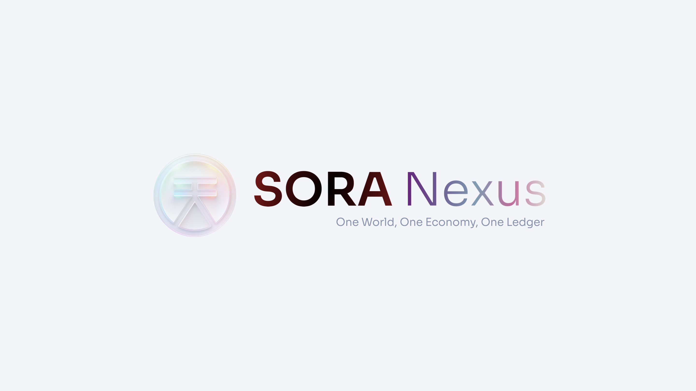
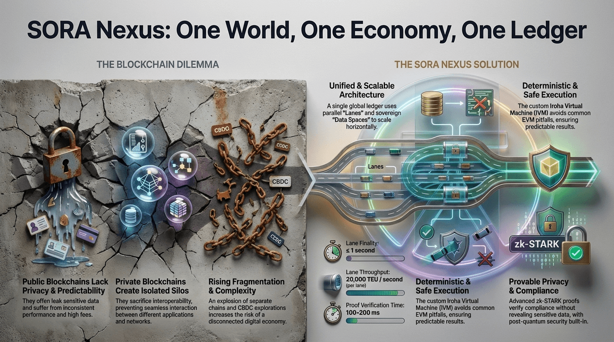
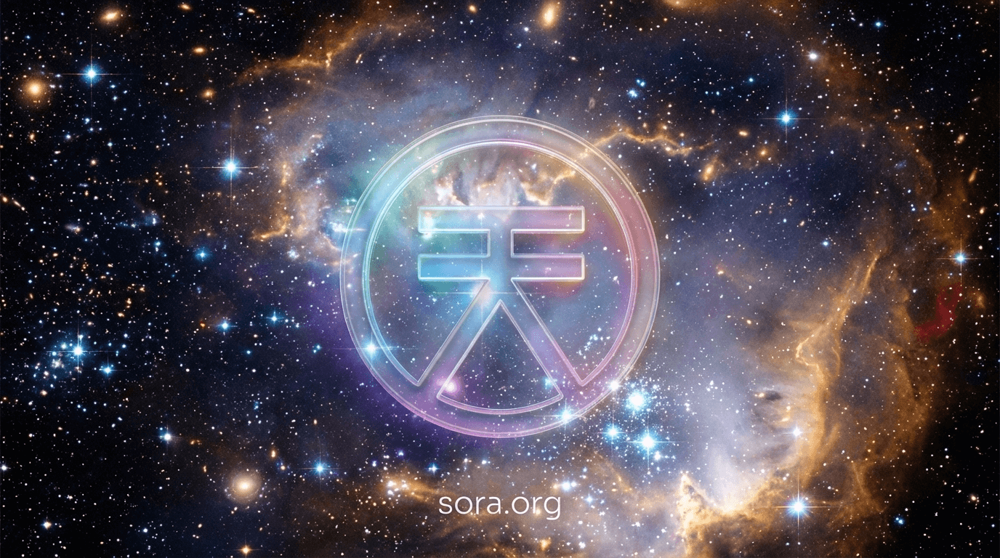

# SORA Nexus

A comprehensive overview of **SORA Nexus (SORA v3)** — an infinitely scalable, multi-domain blockchain network built on **Hyperledger Iroha 3**, designed to unify global finance, DeFi, and institutional systems under **one universal ledger**.

## Overview

### What Is SORA Nexus?
**SORA Nexus** is a next-generation blockchain network powered by **Hyperledger Iroha 3**, engineered to replace the fragmented ecosystem of L1, L2, appchains, and private ledgers with **a single, unified system**.  
It combines:

- A deterministic virtual machine (**IVM**)  
- Multi-domain **data spaces**  
- Horizontally scalable **parallel lanes**  
- zk-STARK–based **FASTPQ proofs**  
- Near–1-second finality  
- Built-in privacy and auditability  
- Governance by the **SORA Parliament**

SORA Nexus positions itself as the **“end of history”** for blockchain architecture—an infrastructure capable of hosting the full spectrum of financial activity, from DeFi to CBDCs.

### Why SORA Nexus
Modern blockchain systems face several persistent limitations:

- Fragmentation across many incompatible networks  
- Lack of deterministic execution  
- Trade-offs between privacy and composability  
- Siloed private ledgers  
- Cross-chain bridge vulnerabilities  
- Inconsistent performance and weak auditability  

SORA Nexus addresses these issues by operating as **one ledger with
many sovereign zones**, each capable of enforcing its own policies
while participating in a globally composable economy.

### SORA Nexus Whitepaper
Full technical details are available in the <a href="https://sora.org/sora_nexus_whitepaper.pdf" target="_blank" rel="noopener">SORA Nexus Whitepaper </a>.

## Unified Architecture: One Network, Many Data Spaces

### What Are Data Spaces
**Data spaces** are sovereign, configurable zones within SORA Nexus.  
Each data space:

- Has its own privacy, routing, and compliance policies  
- Can be public, private, or consortium-based  
- Maintains isolated transaction execution  
- Still participates in a **shared global ledger** through cryptographic commitments  

This architecture allows CBDCs, enterprises, and DeFi protocols to coexist without launching separate chains.

### Why Do They Matter
Traditional blockchains require:

- New chains for new jurisdictions  
- Bridges for interoperability  
- Dedicated infrastructure per application  

SORA Nexus eliminates this by enabling expansion **through configuration**, not through new chains.  
Data spaces can also exchange value and invoke cross-domain actions
**atomically** if policy allows.

> The platform can grow to accommodate new demand through configuration, not new infrastructure

### Composability Across Sovereign Domains
Even private data spaces publish:

- State root hashes  
- Data availability commitments  
- zk-attestations  

This ensures **global verifiability** without compromising confidentiality, allowing—for example—a CBDC token to serve as liquidity in a public DEX.

## Deterministic Execution: The Iroha Virtual Machine

### What Is the IVM?
The **Iroha Virtual Machine (IVM)** is a custom deterministic runtime built specifically for SORA Nexus.  
Key properties:

- Fixed ABI (assets, accounts, memory)  
- Register-based architecture  
- Forbidden nondeterministic behaviors  
- Predictable traps for all invalid operations  
- Versioned system calls  
- Zero reentrancy and no hidden side effects  

Smart contracts are written in **Kotodama**, compiling to deterministic bytecode.

### Why Determinism Is Critical
Unlike EVM-based systems, the IVM eliminates:

- Reentrancy bugs  
- Gas refund quirks  
- Precompile inconsistencies  
- Floating-point divergence  
- Hardware-dependent behavior  

This ensures that **adding validators or upgrading hardware cannot change execution outcomes**.

### Auditable and Future-Proof
The IVM produces:

- Merkleized execution receipts  
- Commitments over memory + register state  
- Explicit, versioned system call traces  

This makes the network predictable, safe, and easy to audit.  
Upgrades to the VM happen via governance without forking.

## Horizontal Scalability: Lanes and the Merge Ledger

### Parallel Lanes Explained
**Lanes** are independent, parallel transaction pipelines.  
Multiple lanes can process transactions simultaneously, increasing throughput linearly with the number of lanes.

### The Merge Ledger
At each block interval:

- All lane outputs are collected  
- A **merge block** creates a single canonical chain  

This preserves:

- Global atomicity  
- Unified history  
- Single-headed finality  

### Elastic Scaling
Lanes can:

- **Split** when demand rises  
- **Fuse** when idle  

This yields elasticity without new infrastructure or forks.

### Performance Characteristics
- ~1-second finality per lane  
- NPoS SUMERAGI BFT consensus  
- No empty blocks  
- Support for post-quantum signatures (e.g., ML-DSA-87)

Through this model, throughput can scale to tens of thousands of TPS while maintaining global composability.

## Privacy and Auditability: FASTPQ Proofs

### Overview of FASTPQ
**FASTPQ** is SORA Nexus’s zk-STARK–based proving system, offering:

- Post-quantum security  
- Proof verification in <100 ms  
- Batchable transaction trace verification  
- No reliance on trusted setups  

### Use Cases
- CBDCs proving monetary correctness without exposing transaction details  
- Private exchanges proving solvency  
- Regulatory compliance proofs  
- Cross-domain validation of hidden state transitions  

### Data Availability Layer
Two DA modes:

- **Public data spaces** → erasure coding + sampling for global reconstruction  
- **Private data spaces** → commitments to ensure availability without exposing content  

Together, zk-proofs + DA ensure **confidentiality with integrity**.

## Governance and Evolution

### Governance Model
SORA Nexus uses an **on-chain governance system** powered by the **XOR token**.  
Governance can modify:

- Cryptography choices  
- Consensus parameters  
- Data space configurations  
- Lane counts  
- Fee structures  

All changes are recorded in the **iroha_config registry**.

### Bonded Proposals
Proposers must stake XOR.  
Spam or malicious proposals result in slashing, ensuring responsibility and alignment.

### Forkless Upgrades
Network-wide changes—such as new VM versions—activate at designated block heights across all lanes without splitting the chain.

## Real-World Applications

### CBDCs
SORA Nexus is designed for **national-scale digital currencies**:

- Private issuance domains  
- Public programmable finance domains  
- ISO 20022 message compatibility  
- zk-auditability for regulators  

Real-world deployments influenced its design, including:

- Cambodia’s **Bakong** (>$150B annual volume)  
- CBDC pilots in Papua New Guinea, Palau, Laos, Solomon Islands  

### DeFi and Open Finance
Public data spaces support:

- DEXes  
- Lending platforms  
- Stablecoins  
- Real-world assets (RWAs)  
- NFT markets  

These can interoperate natively with institutional assets like CBDCs or tokenized bonds.

### Enterprise and Cross-Border Finance
Gateways convert:

- SORA state proofs → ISO 20022 messages  
- CBDC transactions → cross-network verifiable statements  
- Inter-domain actions → atomic global operations  

This enables **secure cross-border corridors** and interoperable digital asset markets.

## Conclusion

SORA Nexus proposes a unified architecture that addresses long-standing blockchain shortcomings through:

- Deterministic smart contract execution  
- Horizontally scalable lane architecture  
- Sovereign data spaces with global composability  
- zk-STARK–based auditability  
- Privacy-preserving compliance  
- Governance-driven evolution without forks  

By combining these capabilities, SORA Nexus aspires to become **the
universal ledger for global finance**—the infrastructure enabling
**one world, one economy, one ledger**.

> SORA Nexus. No other blockchain is needed.

## References

- [SORA Nexus Whitepaper (PDF)](https://sora.org/sora_nexus_whitepaper.pdf)

## Learn More

- [SORA Integrated Plan](/integrated-plan)
- [Request Features on SORA](/rfp)
