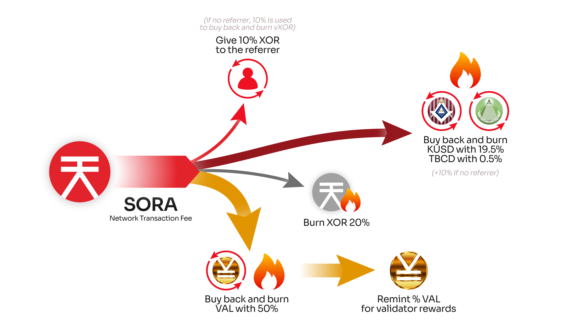

# SORA V3

## Introduction

The SORA platform seeks to bring broad social benefits to its users through cutting-edge technology and the robust flexibility that only a blockchain like Hyperledger Iroha 2 can provide. A promising pool of projects, including the aforementioned SORA decentralized economy, is already underway to take advantage of Iroha 2's capabilities. These include central bank digital currencies, savings bonds, and other innovative NGO programs aimed at social development.

## The SORA V3 Hubchain

At the core of this network upgrade lies the SORA v3 Hub Chain, an infrastructure that:

- **Enables seamless collaboration**: Bridging permissioned and decentralized systems for cost reduction and mutual benefit.
- **Enhances resilience**: De-correlates CBDCs and other Government-issued digital assets from political and economic instability, providing a stable, supranational platform for global transactions.
- **Supports economic sovereignty**: Balances the role of nation states in managing their domains with the freedom of borderless financial activities.

The SORA v3 Hub Chain will enable anyone, including central banks, to be able to create their own assets on the global SORA v3 platform. For those wanting greater privacy, they can process transactions in a private subnet they control, without sacrificing the security or interoperability of a supranational, decentralized blockchain.

Built on [Hyperledger Iroha 2](https://www.lfdecentralizedtrust.org/blog/announcing-hyperledger-iroha-2), the SORA v3 Hub Chain empowers nations, institutions, and individuals by providing a solid infrastructure base to create a robust and inclusive financial system, bringing the best of blockchain technology under one network.

## SORA V3 Tokenomics

The SORA V3 tokenomics were defined over two iterations. The first called for a suspension of TBCD minting while production was funded through the now defunct VXOR token. The second and current iteration uses the KUSD Dollar-pegged synthetic asset to fund production, while implementing buyback and burn of this asset within network transactions. Below is a detailed overview of both iterations.

### First Iteration

Economies are like organisms; they are functioning, living entities and must constantly grow and evolve to stay alive. This means that money, the lifeblood of an economy, needs to provide sufficient nourishment to producers while also not increasing beyond the size needed to sustain health.

In SORA v2, the SORA (XOR) token (the main token on the network, used to pay gas fees) had an elastic supply managed by a token bonding curve. The theory behind this was sound — to manage the token supply to meet the economy's needs. However, without sufficient reserves, the SORA v2 economy experienced liquidity shortages.

At the same time, countries worldwide have been debasing their currencies by expanding their monetary bases for non-productive uses. While not directly related to SORA, this is an important narrative for billions of people, and (perhaps intentionally), many people became scared of any expansion in currency supplies, even for productive uses. This meta-narrative has important implications for SORA because we have to work within the confines of the grand narrative created globally, as we are, as of yet, too small to direct it ourselves.

Because of the state of the world and the needs that people all over the world have, SORA v3 must be able to provide adequate funding for producers to target high GDP growth in the SORA economy while also limiting the increase of token supply expansion, given the meta-narrative that has caused people to be fearful of inflation.

Builders in the SORA ecosystem under the v3 tokenomics will still get paid for their work, but not in XOR. Instead, they will be paid in stable tokens such as [KUSD](./kusd.md), although the final tokenomics are still under research.

Keep in mind that increasing the amount of goods and services in an economy is crucial, by definition, to expand the GDP. Therefore, any viable economic system needs to keep in mind ΔMV=ΔPY (_take a look at the [SORAnomics](./sora-economy.md#soranomics) for more information_) and understand that **you need an expansion of purchasing power for production to create more goods/services**. SORA v3 tokenomics follows the [General Quantity Theory of Money (Disaggregated Quantity Theory of Money)](https://cyberleninka.ru/article/n/banks-and-economic-growth-the-general-theory-in-a-basic-disequilibrium-model-with-five-rationing-regimes) so our economy can expand sustainably and reliably, which will enable us to accomplish our goal of creating a new economic order for the world that enables collaboration instead of exploitation and competition. _We will all own XOR, and we will be happy._

### Second Iteration

Given the current state of the world, like it or not, even cryptoland is dollarized. That means SORA must also provide access to tokens at par with the dollar if we want to increase market share. Fortunately, _Kensetsu_ (SORA’s version of MakerDAO) is a natural way for us to provide this access to our users.

However, given the low liquidity for Kensetsu assets up until now, especially KUSD, there haven’t been any good options for SORA users to access stable USD values. So, to build the SORA economy into one that is useful in daily life, we, as an ecosystem, should work to maintain the peg of at least KUSD so that there is reliable liquidity for a token with dollar value, which is the current world standard (until XOR takes over).

#### BUIDLing NEO

Creating financial software demands the highest quality code and repeatable processes; otherwise, it cannot be reliably used. Teams that BUIDL in the SORA ecosystem are expected to deliver the best results and have consistently proven themselves. However, professional teams cannot be expected to work for free, nor should they. Because we are still in the _BUIDL_ (build) phase of creating the SORA economic system, we should pay teams that work in the SORA ecosystem in a unit of account that is readily understandable, namely w.r.t. dollars (USD, also known as _cuck bucks_).

So, as part of the improvements to SORA on our journey to v3, KUSD is now proposed to be used to pay builders. To create the necessary KUSD and have it maintain its peg, it is important to use only hard collateral (not soft cats😿).

To maintain the peg of KUSD to cuck bucks, it is proposed that the SORA ecosystem use a TBCD treasury to buy back and burn KUSD whenever it goes below the peg. This can increase the XOR supply in the short term, but in the future, when there is more demand for KUSD, and the ecosystem has been built up (which can only be done by maintaining the peg), this TBCD will all be burned through a buy-back-and-burn mechanism (a portion of transaction fees), which will also burn the XOR created (XOR is backed by TBCD, so burning TBCD will also burn XOR—it’s a 2-for-1).

#### Increasing Output While Deflating XOR

There are two principles of economics to keep in mind when creating an economic system:

1. the principle of economic growth (ΔMV=PΔY)
2. the principle of elasticity

Regarding the first, you need to increase purchasing power for economic expansion. Otherwise, there will be crowding out of uses for existing money. Consider a simple example of a small economy with just three people, each having 2 XOR. In this simple economy, there are only 6 XOR, and if you want to build, let’s say, a bridge that costs 2 XOR to build, then that 2 XOR has to come from among the three people in the economy. So, to build the bridge without expanding the purchasing power in the economy, you need to convince people to give up their XOR, potentially promising some large bonus in the future (security).

However, this can be a costly way to obtain funds if a very large bonus has to be paid to convince people to give up their XOR. So another option is to inject more XOR into the economy to build the bridge but then charge some fees to use the bridge to withdraw and burn that XOR later in the future. In addition to lowering the cost of infrastructure development, this simple example also highlights the principle of how the elasticity of purchasing power can be used to provide for production without crowding out other uses of money in an economy, as the original three people in the example can use their funds for different uses, like investing in opportunities that will generate even more wealth in the economy.

#### The Vision for SORA V3

We can build a sustainable and self-reinforcing economy by using buy-back-and-burn mechanisms. Through this process, we can create a powerful vortex that will eventually lead to the burning of a large amount of the XOR supply while still creating conditions for financing new output in the SORA economy, as documented below in the transaction fee breakdown.

Yes, it’s a long-term play, but creating a new world economy that isn’t based on debt and enslavement will take time and have a never-ending share of sceptics and critics.

In the SORA economy, XOR is the predictable monetary base. VAL is on top of the XOR monetary base, incentivizing validators and liquidity providers.
Finally, KUSD is on top of the pyramid, the all-seeing eye of the monetary system, reaching out into the existing dollarized world economy. Transaction fees propagate through the SORA economy, like blood pumping, burning some XOR, swapping through VAL and PSWAP, buying back, and burning TBCD and KUSD.
Like a fine tapestry woven to perfection, each layer of the economy is thus encouraged to build value for the SORA economy by contributing their work and ideas so that by working together, the entire SORA ecosystem will flourish.

Within the latest iteration of the SORA economy and including a robust buy-back-and-burn mechanism, the breakdown of transaction fees is as follows;

- 50% to buyback and burn [VAL](./val.md)
- 20% for burning [XOR](./xor.md)
- 10% for [Referral Awards for newcomers](./referral.md)
- 19.5% to buyback and burn [KUSD](./kusd.md)
- 0.5% to buyback and burn [TBCD](./tbcd.md)

A stable, native and decentralized USD stablecoin will allow builders and community projects to deploy projects with a stable unit of account. Marketplaces and purchases of goods and services will enable real economic activity in the SORA ecosystem and beyond.

## The Fujiwara Testnet

The SORA ecosystem continues to evolve with the launch of the Fujiwara (藤原) testnet, a crucial milestone in the journey toward SORA v3. Named after the influential Fujiwara family, which shaped Japan’s Heian period (794–1185) through strategic foresight and cultural refinement, this testnet represents the same values of adaptability, endurance, and innovation.

### **The Legacy of** 藤原・**Fujiwara**

The Fujiwara family rose to prominence in 7th-century Japan, dominating the Imperial court through strategic alliances and governance. Acting as regents (摂政 (Sesshō) and 関白 (Kampaku)), they became the archetypal 公家 (kuge) family, shaping Japan’s cultural and political landscape for centuries. Their legacy inspires the name of the first of many testnets on our Way to SORA v3.

### **Why the Fujiwara Testnet Matters**

The [**Fujiwara testnet**](https://wiki.sora.org/running-a-sora-testnet-node.html) is the first testnet for SORA v3 and is a sandbox for experimenting with the key features of SORA v3, including:

- **Decentralized Finance (DeFi)**: Enabling efficient and secure cross-border transactions.
- **Governance Participation**: Allowing users to actively shape the ecosystem's future by implementing [the SORA Parliament](https://medium.com/sora-xor/the-sora-parliament-af8184dae384).
- **Network Stability**: As a newly developed public blockchain feature, the Fujiwara testnet will provide valuable insights about this innovative feature, as Iroha-based networks have been private infrastructure.

By fostering decentralized collaboration, the Fujiwara testnet will lay the groundwork for a financial ecosystem that thrives beyond geographical and political limitations.

## Learn More

- [Running a SORA V3 Testnet Node](/running-a-sora-testnet-node.md)
- [SORA Economy](/sora-economy.md)
