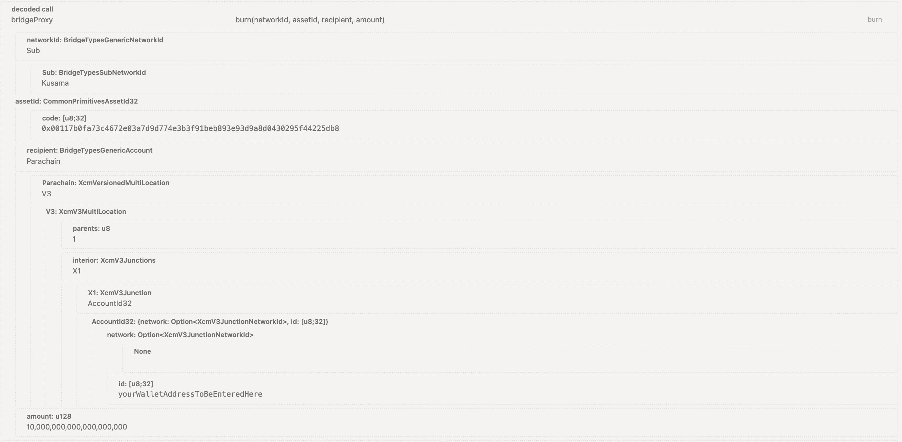

# Substrate Bridge

## Main Components

SORA interaction with Polkadot/Kusama and other relay chains is visualised in the following diagram:


<details>
  <summary>UML diagram code</summary>

```

@startuml

skinparam component {
  BorderColor white
  BackgroundColor red
  FontColor white
}

skinparam interface {
  BorderColor black
  BackgroundColor red
}

Component [SORA mainnet]
interface "Federated\nbridge" as FB

cloud {
  [SORA parachain] as SP
  [Relay chain\n(Polkadot/Kusama)] as RC
  interface "XCM" as XCM1
  interface "XCM" as XCM2
  [Other parachains] as OP
}

[SORA mainnet] - FB
FB - SP
SP - XCM1
XCM1 - RC
RC - XCM2
XCM2 - OP
@enduml

```

</details>

Let's go through all the components mentioned in the figure:

### SORA Mainnet

A standalone network developed on top of the Substrate blockchain is the main object of this documentation. It has all the incoming and outgoing messages to other systems crossing the **Federated Bridge**, which is a central gateway to an external ecosystem.

### Federated Bridge

You can read about the Federated Bridge in [Interoperability](./interoperability).

### SORA Parachain

The SORA parachain serves as a blockchain gateway, allowing seamless integration between SORA and any relay chain ecosystem. It facilitates automatic token transfers, eliminating the need for users to send tokens via extrinsics on the SORA parachain.
By design, the SORA parachain eliminates the requirement for additional transaction signing. The parachain maintains a comprehensive record of tokens that can be transferred, with registration information stored in the XCMApp pallet. This information includes the mapping between the SORA mainnet AssetId and XCM Multilocation for each token.

### Relay chain

In the Polkadot and Kusama ecosystems, the relay chain refers to the main blockchain network that serves as the backbone for the entire network of connected parachains. It acts as a hub or coordinator for multiple parachains, facilitating their communication and interoperability.

The relay chain provides several important features, including cross-chain messaging (XCM), shared security, scalability, and upgradeability. It enables parachains to communicate with each other through the Cross-Chain Message Passing protocol (usually utilising XCM messaging format), allowing the transfer of assets and data between different chains.

### Parachains

Parachains are specialized blockchains that connect to the relay chain. They can have their own consensus mechanisms, governance models, and specific functionality. They rely on the relay chain for security and the ability to interact with other parachains within the ecosystem. As the name suggests, the SORA parachain is also a parachain within this architecture.

::: warning

The execution of XCM transfers and the handling of incoming messages will vary between different chains. Each connected parachain should have its own dedicated reference in the documentation, specifically detailing the implementation in client applications. This reference should specify the exact version of the XCM message being used, as well as the junctions utilized and populated.

:::

## Flows

Delving into the details of cross-chain transfers, you can consult the following top-level diagrams that illustrate the various directional flows:

### SORA to Parachain


_¹ A sidechain asset (registered through [register_sidechain_asset](https://sora-xor.github.io/sora2-network/master/doc/substrate_gen/runtime/runtime_types/parachain_bridge_app/pallet/enum.Call.html#variant.register_sidechain_asset) ) will be burned. A SORA mainnet asset (registered via [register_thischain_asset](https://sora-xor.github.io/sora2-network/master/doc/substrate_gen/runtime/runtime_types/parachain_bridge_app/pallet/enum.Call.html#variant.register_thischain_asset)) will be reserved._

### Parachain to SORA


_¹ The assets can originate from various sources, including other parachains or the Relay Chain, and the resulting action (reserve or burn) on the source chain is dependent on its specific implementation (typically initiated by calling either `xcmPallet.reserveTransferAssets` or `xTokens.transfer`). Ultimately, SORA parachain remains unaware of the final outcome, as it only receives an XCM message that will be subsequently relayed to the mainnet._

## Common Pallets

There are several common pallets used in the SORA project, providing bridge functionality on both the parachain and SORA mainnet sides:

- **SubstrateDispatch**: Developed by SORAMITSU ([source code](https://github.com/sora-xor/sora2-common/tree/develop/pallets/dispatch)). This pallet decodes and checks messages, performs runtime calls, and creates a bridge origin to execute **XCMApp** and **ParachainBridgeApp** extrinsics. Only the bridge origin can call these extrinsics.

- **SubstrateBridgeInboundChannel**: Developed by SORAMITSU ([source code](https://github.com/sora-xor/sora2-common/tree/develop/pallets/substrate-channel/src/inbound)). This pallet handles the submission of incoming messages. While submitting messages can be called from any account, a relayer is used for this function. It utilizes **BeefyLightClient** or **MultisigVerifier** for message verification and **SubstrateDispatch** for message calling.

- **SubstrateBridgeOutboundChannel**: Developed by SORAMITSU ([source code](https://github.com/sora-xor/sora2-common/tree/develop/pallets/substrate-channel/src/outbound)). This pallet is responsible for sending outgoing messages. It is used by the **ParachainBridgeApp** and **XCMApp** to send messages to other networks.

### SORA Mainnet Pallets

On the SORA Mainnet side, the following pallets are used:

- **ParachainBridgeApp**: Developed by SORAMITSU ([source code](https://github.com/sora-xor/sora2-common/tree/develop/pallets/parachain-app)). This pallet serves as the main entry point for clients to send assets through the bridge. It also sends messages to the parachain (**XCMApp**) to register assets. The bridge requires bonding of **ParachainBridgeApp** on the Mainnet and **XCMApp** on the Parachain. It utilizes SubstrateBridgeOutboundChannel to send messages through the bridge and is used by **SubstrateDispatch** to execute messages.

Root extrinsics: `finalizeAssetRegistration`, `registerThischainAsset`, `registerSidechainAsset`, `addAssetIdParaId`, `removeAssetIdParaId`, `mint`.
Extrinsic to be called by user: `burn`.

- **Assets**: Developed by SORAMITSU ([source code](https://github.com/sora-xor/sora2-network/tree/master/pallets/assets)). This pallet implements assets on the SORA 2 Mainnet. It is used by **ParachainBridgeApp** to register, mint, and burn assets.

### SORA Parachain Components

On the SORA parachain side, the following components are used:

- **XCMApp**: Developed by SORAMITSU ([source code](https://github.com/sora-xor/sora2-parachain/tree/develop/pallets/xcm-app)). This pallet establishes the connection between the SORA 2 Mainnet and a relay chain/parachain. It maintains a mapping from the SORA 2 Mainnet AssetId (a 32-byte array) to a general XCM Multilocation. It enables the transfer of assets between SORA 2 Mainnet and a relay chain/parachain. Only the bridge origin can access the pallet's extrinsics. It utilizes **SubstrateBridgeOutboundChannel** to send messages through the bridge and is used by **SubstrateDispatch** to execute messages.

- **XTokens**: Developed by the Open Web3 Stack ([source code](https://github.com/open-web3-stack/open-runtime-module-library)). This component is used by **XCMApp** to send tokens to a relay chain/parachains.

- **XCMExecutor**: Developed by Parity. While not a pallet, it is a crucial component for executing XCM Messages. It utilizes **XCMApp** as a transactor and AssetId converter.

### Federated Bridge Pallets

The Federated Bridge in SORA relies on the following pallets:

- **BridgeDataSigner**: Developed by SORAMITSU ([source code](https://github.com/sora-xor/sora2-common/tree/develop/pallets/data-signer)). This pallet is responsible for collecting signatures from different relayers and checks that message is signed by a valid peer.

Root extrinsics: `registerNetwork`, `addPeer`, `removePeer`, `submit`.
Messages: see [`BridgeCall` enum](https://github.com/sora-xor/sora2-common/blob/2f0aeec218e7646c295f371c4f553f4260e59eff/pallets/types/src/substrate.rs#L126)

- **MultisigVerifier**: Developed by SORAMITSU ([source code](https://github.com/sora-xor/sora2-common/tree/develop/pallets/multisig-verifier)). This independent pallet is used by **SubstrateBridgeInboundChannel** and **BeefyLightClient** for message verification. It is also used by `SubstrateDispatch` to decode and dispatch bridge calls.

Root extrinsics: `initialize`, `addPeer`, `removePeer`.

- **The Relayer**: Developed by SORAMITSU ([source code](https://github.com/sora-xor/sora2-network/tree/master/relayer)). The Relayer is a separate service and not a pallet. It plays a crucial role in the Federated Bridge, passing through messages and holding private keys for signatures, similar to the Beefy bridge implementation.

## Guides

### Asset Registration

To execute a cross-chain token transfer, a registration process for the desired token is required beforehand. Token registration involves using the root extrinsics `ParachainBridgeApp.registerSidechainAsset` and `ParachainBridgeApp.registerThischainAsset`. For instance, to register a native token on the Rococo network, the following procedure is followed:


Similarly, to register a native token from another blockchain as transferable through a parachain, also known as whitelisting, the process is as follows:


These extrinsics send messages to the SORA 2 Parachain, enabling the registration of asset mappings. Without this registration, tokens cannot be transferred through the parachain. Once the token is successfully registered, transfers can be initiated.

### Transfers

::: warning

Only specific XCM messages for/from the corresponding networks have been tested and utilised in the client applications, such as Polkaswap. When constructing your own messages, exercise caution: there is a possibility that your funds could be permanently lost.

:::

#### SORA <-> Kusama

This section showcases various scenarios for bidirectional transfers between SORA mainnet and Kusama.

##### Kusama -> SORA mainnet

To transfer assets from Kusama to the SORA network, additional to the `XOR` for the SORA network transaction, you will need to hold `KSM` tokens to pay for the Kusama network transaction fees.

To fill the call data with information from the figure, follow this [link](https://polkadot.js.org/apps/?rpc=wss%3A%2F%2Fkusama-rpc.polkadot.io#/extrinsics/decode/0x6302030001006d1f0300010100796f757257616c6c657441646472657373546f4265456e7465726564486572650304000000000700743ba40b00000000). Make sure you modify the recipient as well as the amount of tokens to be sent, if needed.


The extrinsic to submit is `xcmPallet` then `reserveTransferAssets(dest,beneficiary,assets,feeAssetitem)`:

- The dest: is `V3`
  - The `interior:XCMV3Junctions` is `X1`
  - The `Parachain` is `2011`
- Then in the next section, `Beneficiary:XCMVersionedMultiLocation` is `V3`
  - Under `V3:XCMMultilocation` the `interior:XCMV3Junctions` is `X1`
  - The `X1:XCMV3Junction` is `Accountid32` and in the `id:[u8:32]` section, input your SORA network account address (as the recipient of the to transfer)
- So far, you now have the sender and the receiver for the transfer, now let’s input the asset.
  - In `assets`: `XcmVersionedMultiAssets` select `V3`, then click `Add Item`
  - In the field `Fungible:Compact<128>` add the number of tokens to be transferred. You have to add twelve zeroes after the amount. In this case, we are sending `10`, so the input is `1000000000000`

Finally, submit the transaction and sign on the pop-up using your password. After the transaction is successful, you will notice your `KSM` balance is reduced in Kusama and has increased proportionally in your SORA account. Now let’s test a transaction in the opposite direction;
::: tip
Although SORA transactions are usually almost instant, cross network transactions will take between 3-4 minutes.
:::

##### SORA mainnet -> Kusama

To transfer assets from the SORA network to the Kusama relay chain, you will need XOR and KSM tokens to pay for the transaction fees, similar to before. To fill the call data with information from the figure, follow this [link](https://polkadot.js.org/apps/?rpc=wss%3A%2F%2Fmof3.sora.org#/extrinsics/decode/0x6700010100117b0fa73c4672e03a7d9d774e3b3f91beb893e93d9a8d0430295f44225db8020301010100796f757257616c6c657441646472657373546f4265456e74657265644865726500008a5d784563010000000000000000). Make sure you modify the recipient as well as the amount to be sent, if needed.



The extrinsic to submit is `bridgeProxy` then `burn`:

- The `networkId` is `Sub` since we are doing a transfer to another Substrate-based chain
  - As a `Sub` type choose `Kusama`
  - As an `assetId`, enter the `KSM` token address `0x00117b0fa73c4672e03a7d9d774e3b3f91beb893e93d9a8d0430295f44225db8`
- Moving on to the recipient configuration;
  - Choose `Parachain`
  - Select version is `V3`
  - Parent is `1` to target Kusama
- Enter your Kusama network address as `accountId`
- Finally, enter the desired `amount` to be sent. You have to add twelve zeroes after the amount. In this case, we are sending `10`, so the input is `1000000000000`

Then, submit the transaction and sign on the pop-up using your password. After the transaction is successful, you will notice your `KSM` balance is reduced in the SORA network and increased in Kusama.

::: tip
Although SORA transactions are usually almost instant, cross network transactions will take between 3-4 minutes.
::: 

#### SORA <-> Rococo

This section showcases various scenarios for bidirectional transfers between SORA mainnet and Rococo.

##### SORA mainnet -> Rococo

To transfer a token to a relaychain, the extrinsic `ParachainBridgeApp.burn` is used. For instance, to transfer a ROC token to the Rococo relay chain, the following procedure is followed:


To specify a parachain as the transfer destination, the following request needs to be made:


By following these steps, cross-chain transfers can be successfully executed, allowing for seamless movement of tokens between different chains within the network.

### How to Track the Status of the Transfer

#### Other Parachain -> SORA mainnet

1. After executing the transaction initiating a XCM message, the `xcmpQueue.XcmpMessageSent` event is emitted.


2. After a certain period of time and upon successful arrival of the message to the SORA Parachain, the `xcmpQueue.Success` event is emitted. This event will have the same message hash as shown in the example from (1). As a result, it will be possible to find `substrateBridgeOutboundChannel.MessageAccepted` from the same extrinsic. The event will contain the nonce of the message, which will be passed to the mainnet.


3. The Parachain routes the message to the mainnet. Once it arrives, the `substrateDispatch.MessageDispatched` event with the same nonce as in (2) is emitted.


