---
head:
  - - link
    - rel: stylesheet
      href: https://cdnjs.cloudflare.com/ajax/libs/KaTeX/0.5.1/katex.min.css
# Add metatags
---

# SORA Synthetics

## What are synthetic assets ?

Synthetic assets are assets pegged to an index using only on-chain collateral. [XSTUSD (SORA Synthetic USD) is a great example of a synthetic asset](https://www.forbes.com/sites/tatianakoffman/2021/11/23/the-rise-of-decentralized-money-on-polkadotnew-algorithmic-stablecoin-launches-on-sora/), as it is pegged to the value of the US Dollar, but currently backed by redeemability to XST, meaning that you can get the face value of XSTUSD given to you in newly minted XST.

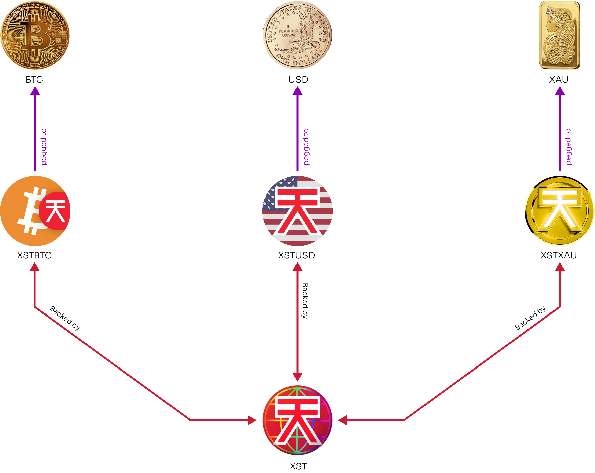

Synthetic assets matter because assets that are fully collateralised on-chain, but are linked to off-chain indices, are incredibly powerful. Purely synthetic assets can be used to represent many types of value, such as, to track the shares of financial instruments and securities. Whether the index is a fiat currency like the USD, a commodity like XAU (gold), or a security like TSLA, having completely on-chain assets to represent these values allows a multitude of composable DeFi operations while being impossible to censor. The possible uses are truly endless, and are limited only by developers’ imaginations and reliable oracle data!

SORA is receiving oraclised data to enable virtually any possible synthetic asset in the network. The implication of this is suddenly many new synthetic assets, similar to XSTUSD, could be created, if the community wants to build them. To power this, a specialised token has been created to be the collateral for synthetic assets in the SORA ecosystem: XST.

## Why are people usually attracted by synthetic assets ?

**Access to Global Markets**: Synthetic assets allow users to gain exposure to a wide range of traditional and digital assets from different global markets. Users can invest in assets that may otherwise be inaccessible due to geographical or regulatory limitations.

**Financial Inclusion**: Synthetic assets can contribute to financial inclusion by providing individuals with limited access to traditional financial services an opportunity to participate in global markets and investment opportunities.

**Lower Barriers to Entry**: Synthetic assets eliminate certain barriers to entry that exist in traditional financial markets. Users can start trading with lower capital requirements, fractional ownership options, and reduced transaction costs compared to traditional asset trading.

**Trading Opportunities**: Synthetic assets provide users with additional trading opportunities, allowing them to capitalise on market trends, price differentials, or arbitrage opportunities. Users can engage in leveraged trading or explore complex trading strategies.

**Diversification**: Synthetic assets enable users to diversify their investment portfolios by gaining exposure to a variety of asset classes, such as stocks, commodities, indices, or currencies.

## **Typical users of synthetic assets**

1. **Crypto Traders**: Because synthetic assets only reflect the face value of an index, they enable trading large amounts without impacting the market price of the underlying assets (e.g. Bitcoin).
2. **International Investors**: Synthetic assets enable trading across multiple currencies from different countries, opening up new opportunities for international investments.
3. **FX Traders**: Synthetic assets provide a unique opportunity for crypto traders to diversify their portfolios and take advantage of trading opportunities in the FX market, without the need for KYC regulations, reducing barriers to entry and increasing accessibility.
4. **Risk-Averse Investors**: Synthetic assets offer potential risk reduction through portfolio diversification and reduced slippage and risk of impermanent loss. It also offers the possibility to hold your assets in a stable synthetic asset of your choice, for example if your local currency is subject to higher volatility.
5. **Cost-Conscious Investors**: Trading synthetic assets doesn't incur interest charges, making it a cost-effective investment option.
6. **Tax-Averse Investors**: Transacting with synthetic assets without incurring taxes provides significant financial benefits for tax-averse investors

## **User stories**

### User story 1: Trading synthetic assets for diversification

As an investor, I want to trade synthetic assets on a decentralized exchange (DEX) so that I can diversify my portfolio and gain exposure to a wide range of assets without holding the underlying assets directly. I want to be able to trade various synthetic assets representing different cryptocurrencies, stocks, and commodities to reduce risk and maximize potential returns.

### User story 2: Hedging against market volatility with synthetic assets

As a trader, I need the ability to use synthetic assets on a DEX to hedge against market volatility. By trading synthetic derivatives that track the price movements of specific assets, I can protect my positions from potential losses and manage risk effectively, even during turbulent market conditions.

### User story 3: Leveraging synthetic assets for speculative trading

As a high-risk trader, I want to leverage synthetic assets on a DEX to amplify my potential profits from short-term price movements. By trading synthetic derivatives with leverage, I can magnify my gains without holding large amounts of collateral, allowing me to participate in speculative opportunities with increased financial flexibility.

### User story 4: Accessing traditional assets on a DEX with synthetic assets

As a crypto investor, I desire the ability to gain exposure to traditional assets like stocks, indices, and fiat currencies through synthetic assets on a DEX. This way, I can easily access and trade traditional markets in a decentralised way, directly from my cryptocurrency wallet, without the need to go through traditional financial intermediaries.

### User story 5: Yield Farming and Liquidity Provision with synthetic assets

As a DeFi enthusiast, I want to participate in yield farming and liquidity provision by using synthetic assets on a DEX. By supplying liquidity to synthetic asset pools, I can earn rewards and fees, helping to ensure the availability and stability of these assets for other traders and investors in the decentralized ecosystem.

## How do SORA synthetic assets work ?

XST is the collateral asset backing all the SORA synthetic assets. It is also a reserve currency of the SORA Token Bonding Curve, along with ETH, DAI, VAL, PSWAP, and TBCD.

XST helps to solve the problem of XOR liquidity by creating synthetic assets backed by a variable amount of XST and pegged to a target index (e.g., a currency). The XST token is minted/deminted (burned) to always guarantee the value of the pegged index. For that reason, XST has been referred to as a _platform token_ because it is the basis, or collateral, for all synthetic assets in SORA.

XST does not require over-collateralization and users of synthetic assets do not risk liquidation. This is because new XST can always be minted to provide the full value of a synthetic asset upon exchange back into the XST platform token.

In the case of synthetic assets, as they are backed by the XST platform token, XST can be algorithmically minted or deminted to provide the full value for the synthetic assets upon demand. The XST Primary Market Maker that mints/demints synthetic assets and the XST platform token are built-in as a liquidity source into Polkaswap’s liquidity aggregator, so buyers/sellers will always get the full value in XST platform tokens for their synthetic assets, and the price will never deviate (lower or higher) from the asset price. Therefore, synthetic assets are not subject to price slippage or a lack of liquidity. This works, for example, in the case of XSTUSD, because a single XSTUSD is a claim for $1 USD *worth of XST*, and **not a claim for the actual $USD itself**.

## Ad Astra

New synthetic assets can be linked to an oracle’s price feed via on-chain governance to create new synthetic assets (e.g., XSTXAU for a synthetic gold asset). The only limitation is getting the source of oracle data relayed to SORA.

## Implementation

### Extrinsics

#### Enabling synthetic asset
- **`XSTPool::enable_synthetic_asset`**: enable selected synhtetic asset for trading (sudo only).
  Parameters:
  - `asset_id`: A synthetic asset's id.
  - `reference_symbol`: An oracle symbol depicting the price of the selected synthetic asset.
  - `fee_ratio`: Fixed point number depicting the fee ratio paid during trading the chosen synthetic asset.
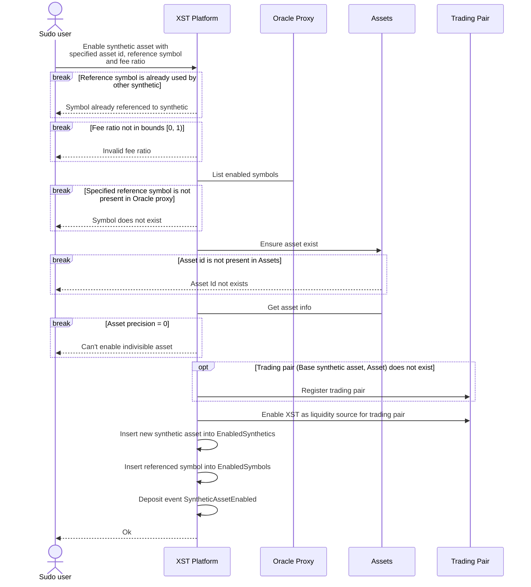

#### Registring new synthetic asset
- **`XSTPool::register_synthetic_asset`**: register new asset and enable it for trading as synthetic (sudo only).
  Parameters:
  - `asset_symbol`: An asset's symbol.
  - `asset_name`: An asset's name.
  - `reference_symbol`: An oracle symbol depicting the price of the new synthetic asset.
  - `fee_ratio`: Fixed point number depicting the fee ratio paid during trading the chosen synthetic asset.
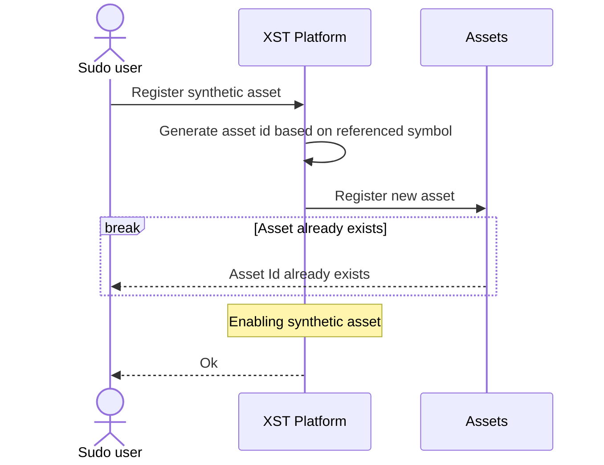

#### Setting reference asset
- **`XSTPool::set_reference_asset`**: set new asset id as the reference asset (sudo only).
  Parameters:
  - `reference_asset_id`: New reference asset id.
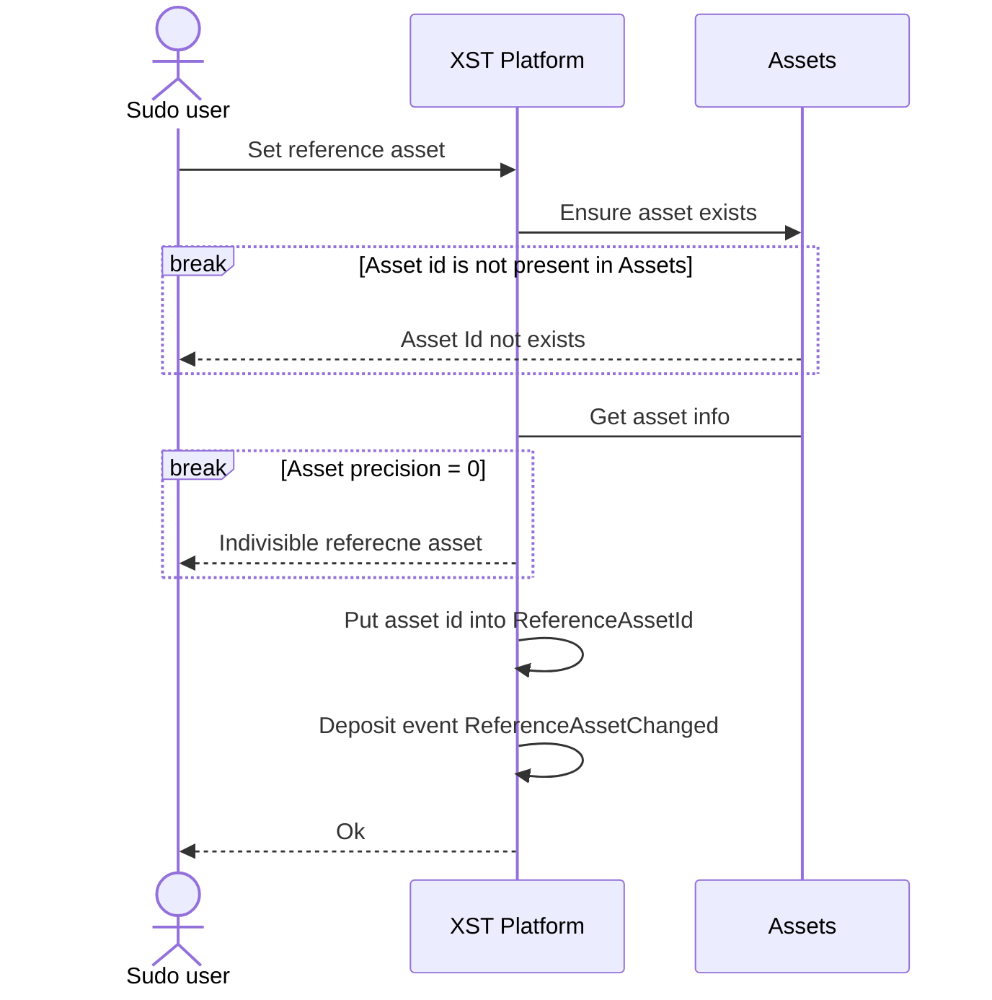

#### Disabling synthetic asset
- **`XSTPool::disable_synthetic_asset`**: disable trading for selected synthetic asset (sudo only).
  Parameters:
  - `synthetic_asset`: Synthetic asset id for disabling.
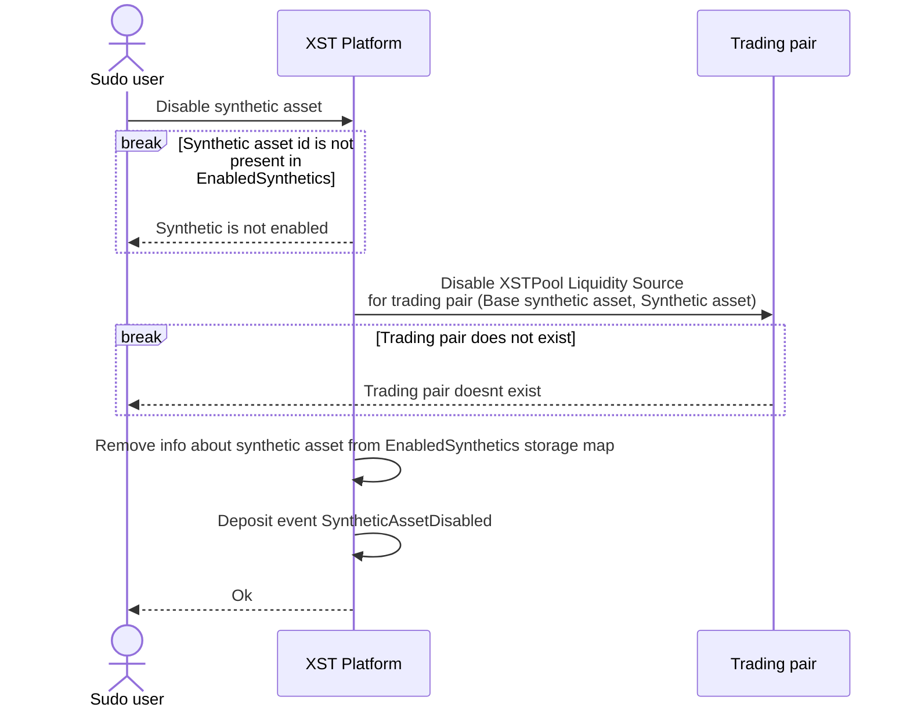

#### Removing synthetic asset
- **`XSTPool::remove_synthetic_asset`**: remove synthetic asset from XSTPool (sudo only).
  Parameters:
  - `synthetic_asset`: Synthetic asset id for removal.
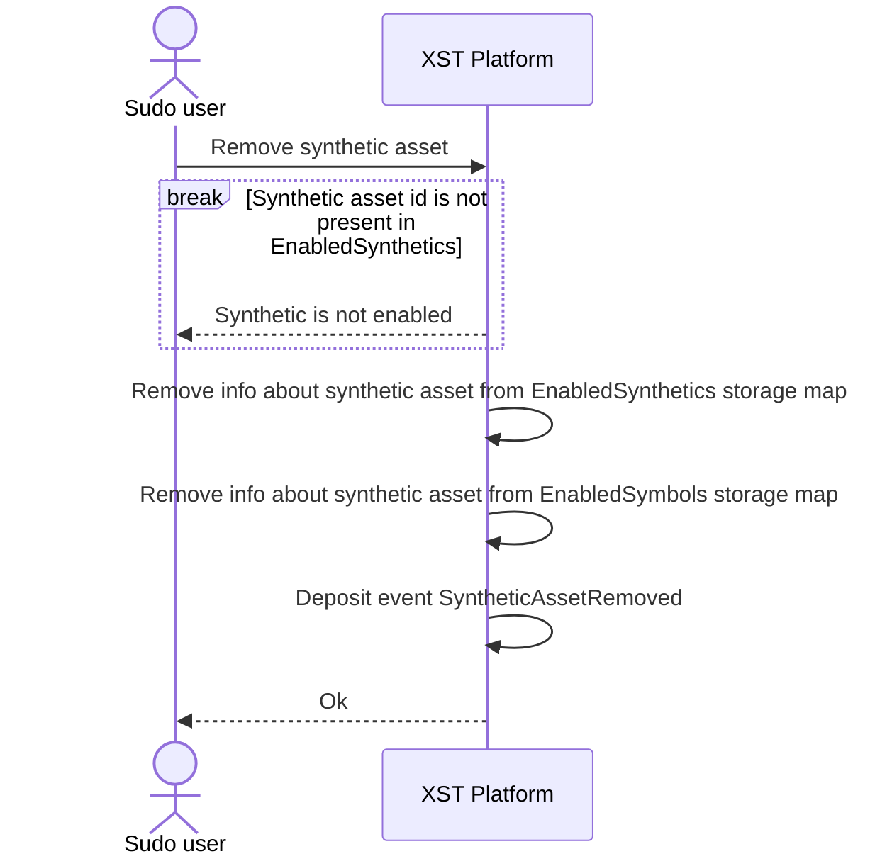

#### Setting synthetic asset fee
- **`XSTPool::set_synthetic_asset_fee`**: set new fee ratio for particular synthetic asset (sudo only).
  Parameters:
  - `synthetic_asset`: Synthetic asset id.
  - `fee_ratio`: New fee ratio
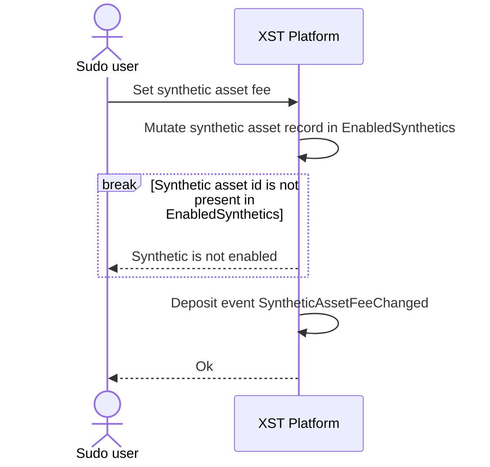

#### Setting synthetic base asset floor price
- **`XSTPool::set_synthetic_base_asset_floor_price`**: set the new floor price for base synthetic asset (sudo only).
  Parameters:
  - `floor_price`: New floor price.
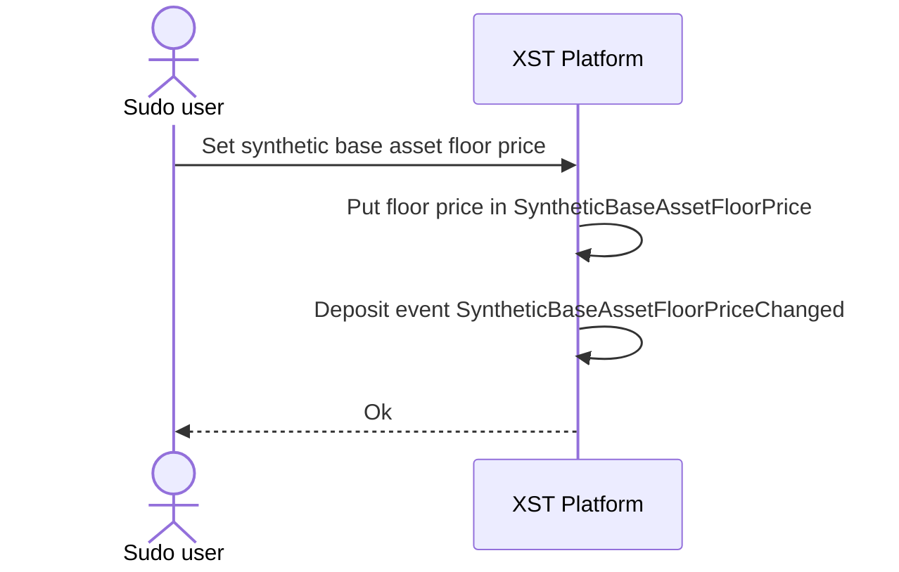

### LiquiditySource trait implementation

#### Quoting synthetic asset

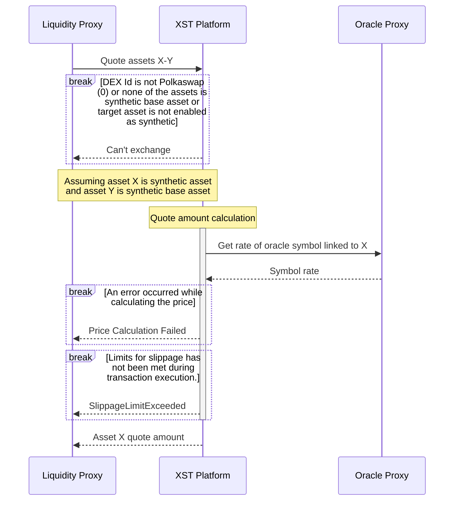

#### Exchanging synthetic asset

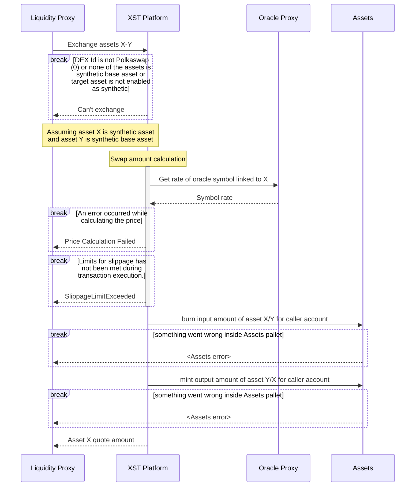

## Fallback mechanism
The fallback mechanism in the XST Platform ensures the timely deactivation of outdated symbols.
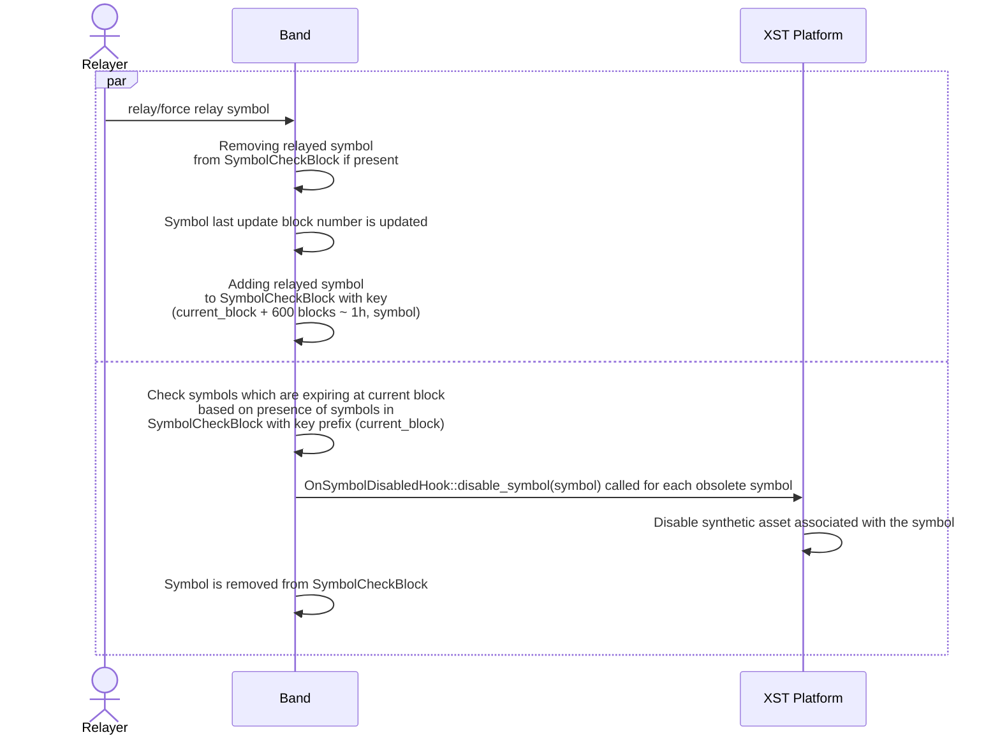

## Base synthetic asset buy/sell limits
To safeguard against potential manipulative activities at the onset of the synthetic platform, a trading cap is introduced on the base asset (XST). A cap of 10 million XST is set for both buying and selling of synthetic assets.
Trades exceeding this threshold will prompt an error message.

## Dynamic fee mechanism

### Notation
| Notation    | Description                          |
| ----------- | ------------------------------------ |
| $\delta$    | Price feed deviation threshold       |
| $P_i$       | Current epoch (i) oracle price       |
| $\tau$      | Dynamic fee decay constant           |
| $\mu$       | Minimum dynamic fee                  |
| $\phi_t(i)$ | The current epoch’s  (i) dynamic fee |
where epoch denotes the period of time between oracle updates.

### Dynamic fee calculation
To deter potential exploitative trading based on anticipated oracle price changes (namely frontrunning), we're implementing a dynamic fee, which is charged during any trade involving synthetic asset. This fee adjusts based on the percentage change in the oracle symbol price.

Dynamic fee calculated as:

$\phi_{D} ( i ) = \tau * \phi_{D} ( i-1 ) + max ( [P_{i} / P_{i-1} - 1  - 2 \delta- \mu], 0 )$

$\phi_D(0) = 0$

The parameter constants are stored inside the Band pallet.

### How the fee is charged
The dynamic fee is incorporated into $S_{f}$ term (which is defined in section **Quote/swap amount calculation process**). The $S_{f}$ is therefore defined as the sum of the dynamic fee ratio and a synthetic asset's base fee ratio, which is set via `XSTPool::set_synthetic_asset_fee`.

## Quote/swap amount calculation process

### Notation

| Notation           | Description                                                               |
| ------------------ | ------------------------------------------------------------------------- |
| $S_f$              | Fee ratio associated with the selected synthetic asset                    |
| $S_o$              | Rate of the oracle symbol associated with the selected synthetic asset    |
| $B_p^b$            | Reference buy price of the base synthetic asset in reference asset units  |
| $B_p^s$            | Reference sell price of the base synthetic asset in reference asset units |
| $\overline{R_p^b}$ | Reference buy price of the reference asset in XOR units                   |
| $\overline{R_p^s}$ | Reference sell price of the reference asset in XOR units                  |
| $O$                | Output amount                                                             |
| $I$                | Input amount                                                              |
| $F_{XOR}$          | Fee (in XOR)                                                              |

### PriceTools price calculation

Before delving into how quote and swap amounts are calculated, it's crucial to understand how the price of a synthetic base asset is calculated in reference units.

The PriceTools pallet stores two distinct average prices for each asset found in the XYK Pool. These averages are recalculated every block in relation to their previous values, ensuring their difference doesn't exceed certain lower and upper ratio bounds. Two values are stored because there are two scenarios: one could **buy** XOR with some asset or **sell** XOR for some asset. The capping lower and upper ratio bounds differ in each scenario, introducing asymmetry. The lower ratio bound in buy cases equals the upper ratio bound in the sell case, and vice versa.

If one is buying the synthetic base asset, its price is calculated as follows:

$B_p^b = \frac{\overline{R_p^b}}{\overline{B_p^s}}$

This equation calculates the price one would get by swapping the reference asset to XOR (i.e., **buying** XOR) and then buying the synthetic base asset with XOR (i.e., **selling** XOR).
The sell price of the synthetic base asset is calculated as follows:

$B_p^s = \frac{\overline{R_p^s}}{\overline{B_p^b}}$

### Synthetic base floor price

If the calculated price of synhtetic base asset exceeds the limit in `SyntheticBaseAssetFloorPrice`, then the price is set to this limit.

### Sell case (Selling synthetic base to some synthetic asset)

#### With desired input

$O = \frac{(I - I\times S_f)\times B_p^s}{S_o}$

Since the fee is calculated in XST and should be paid in XOR, we need to convert it

$F_{XOR} = \frac{I\times S_f}{\overline{B_p^s}}$

#### With desired output

$I = \frac{O \times S_o}{B_p^s} \times \frac{1}{1 - S_f}$

$F_{XOR} = \left (I - \frac{O \times S_o}{B_p^s} \right ) \times \frac{1}{\overline{B_p^s}}$

### Buy case (Buying synthetic base with some synthetic asset)

#### With desired input

$O = \frac{I \times S_o}{B_p^b} \times (1 - S_f)$

$F_{XOR} = \frac{I \times S_o}{B_p^b} \times S_f \times \frac{1}{\overline{B_p^s}}$

#### With desired output

$O_{w/\ fee} = \frac{O}{1 - S_f}$

$I = \frac{O_{w/\ fee} \times B_p^b}{S_o}$

$F_{XOR} = \frac{O_{w/\ fee} - O}{\overline{B_p^s}}$
