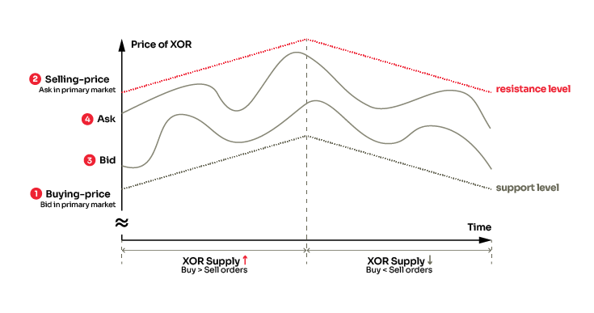
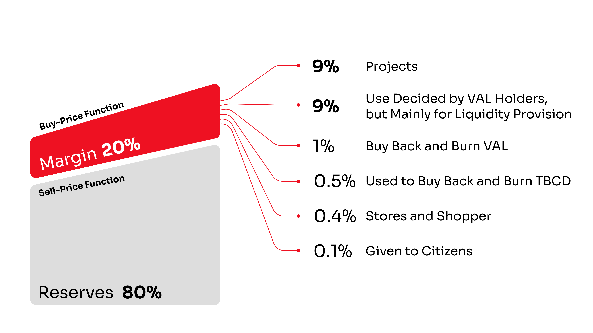
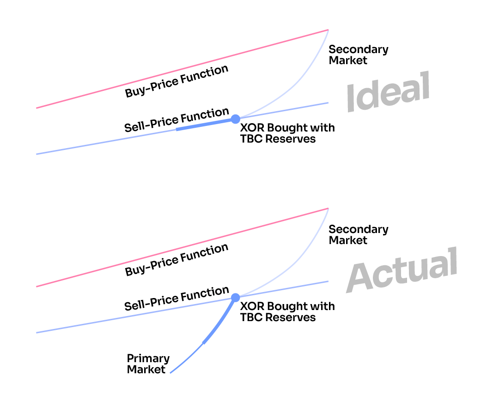

# Token Bonding Curve

The [token bonding curve](https://medium.com/coinmonks/token-bonding-curves-explained-7a9332198e0e) (TBC) manages the supply of tokens in a rational way, without the involvement of humans, to create a system that avoids the boom-bust problems of traditional economies, and the deflationary economics of many cryptocurrencies.

A TBC is a smart contract that takes the input of a token and outputs a new token. This creates a plethora of possible variations to drive an exciting area of research, but in SORA we use a simple model where there are two linear functions: a **Buy-Price** Function and a **Sell-Price** Function.

.png>)

Put simply, the token bonding curve is essentially an infinitely liquid, decentralized central bank. At any time, you can buy newly minted XOR from the token bonding curve using specific **reserve assets**, or sell your XOR tokens (which are instantly burned) for one of those assets.

Furthermore, because the token bonding curve’s pricing functions slope upwards, the **price increases with the token supply.** Keep in mind that with a token bonding curve, **XOR price and supply are correlated**, and they move accordingly.

<figure><figcaption>
Price will increase when supply rises and vice versa
</figcaption></figure>

Another important implication of this mechanism is that XOR price on the secondary market (Polkaswap, Uniswap, CEXs...) tends to be limited to a certain price range (illustrated as the red triangle in the diagram). In fact, if a user trades XOR outside that range, it creates an **arbitrage opportunity** to buy/sell XOR below/above the token bonding curves prices: **XOR volatility is thus reduced.**

## Why is the token bonding curve useful?

- **Autonomous Management of Token Supply to Match Demand (Elastic Supply)**. The token bonding curve introduces and removes XOR from circulation to meet the demand of the market. This ensures sustainable economic growth and price stability of the token economy, as the system can adapt to the changing needs.
- **Deep and Immediate Liquidity**. The bonding curve contract is the counterpart of the transaction and always holds enough buyback reserves (_read more about this below in the "Ideal and Actual Scenarios" paragraph_).
- It mitigates influences of pump-and-dump/market-manipulation attacks
- XOR's decentralized monetary policy offers protection from abuse by authorities and full transparency for users.
- Primary market buy-back reserve limits the ability of governments or short-sellers to manipulate the market.
- The SORA v2 monetary system is neither debt-based nor debt-driven, and new tokens are always allocated under democratic supervision, which works to eliminate the unsustainable boom-bust cycles in contemporary economic systems.
- The current buy/sell-prices offered by the token bonding curve provide support & resistance levels, or a confidence range for the price of XOR in the market, with forward guidance.
- 20% of the quantity bought from the buy function are reserved for different players in the SORA network:
  - 1% goes to buyback-and-burn [VAL](./val)
  - 9% use is decided by [VAL](./val) holders, but mainly for liquidity provision
  - 0.1% is given to citizens
  - 0.4% is given to stores and shoppers
  - 0.5% is used to buyback-and-burn [TBCD](./tbcd)
  - 9% is used for projects

While the SORA economy is in its infant phase, the token bonding curve plays a crucial role in maintaining XOR's store-of-value property. The ability to set confidence ranges of token price movements lowers the psychological boundary towards accepting XOR for payments.

It is important to note that **the token bonding curve does not guarantee XOR's price stability,** but rather a measure of [forward-guided](https://www.ecb.europa.eu/explainers/tell-me/html/what-is-forward_guidance.en.html) price predictability.

## Ideal and Actual Scenarios

Let's now focus on **reserves**, which play a crucial role in the TBC mechanism.

At the launch of the SORA v2 network, 350,000 XOR will already be in existence. This means that the SORA token bonding curve will have an unfunded liability of 350,000 XOR worth of DAI, 350,000 XOR worth of ETH, 350,000 worth of VAL, and 350,000 XOR worth of PSWAP. This is the **actual scenario**.

The Buy-Price Function has been set at 900$ at Soft launch, its equation is _y = mx + b, where b:=634$_ and the slope _m := 1/1337._

The implication of this scenario is that the Sell-Price Function of the token bonding curve is not 20% lower than the Buy-Price Function (as it should be in the **ideal scenario)**, but it is even less. In fact, there is little liquidity in the reserves for you to sell your XOR tokens, and the price on Sell-Price Function may be low compared to the secondary market price.

.png>)

The Actual Sell-Price Function increases as the reserves increase, approaching the Ideal Sell-Price Function, which is 20% lower than the Buy-Price Function.

The Buy-Price Function is the same in both the Actual and Ideal scenarios.

This is why building reserves after launch is crucial and **there is a special incentive program in PSWAP (25% of the total PSWAP supply) for users that buy newly-minted XOR on the TBC.** You can read the details [here](https://medium.com/polkaswap/pswap-rewards-part-2-the-sora-token-bonding-curve-70fab4c3f1b8).

## Selling in the Actual Scenario

Considering that the ideal reserves are a long-term goal, it is important to understand how selling in a token bonding curve that is not fully collateralized works.

As you can see, the price behaves differently in the actual scenario, where users will sell their tokens at a lower price than the ideal scenario. It is important to note though, that when the reserves increase, the Sell-Price function will become closer and closer to the ideal Sell-Price Function, and users will already have good liquidity to sell even large amounts. You can see a detailed selling example with numbers [here](https://medium.com/polkaswap/pswap-rewards-part-2-the-sora-token-bonding-curve-70fab4c3f1b8).

In addition, there are extra fees when selling with low collateralization:

- under 30% collateralized: +1% fee
- under 20% collateralized: +3% fee
- under 10% collateralized: +6% fee
- under 5% collateralized: +9% fee

These extra fees will be burned.

## Token Bonding Curve and Parachain Auctions

In the future, the TBC will play a key role in securing a Parachain slot for the SORA network on Polkadot and Kusama.

At first, SORA will join Kusama as a Parachain through a Crowdloan, as mentioned [here](https://medium.com/sora-xor/the-sora-network-kusama-parachain-auction-5a6fe3a5f35f?source=user_profile---------0-------------------------------).

This will bring KSM to the SORA network (and Polkaswap), so users will be able to use KSM as a reserve asset in the TBC, and that KSM can be used to secure the slot for the following year.

In addition, Parity is also developing a Polkadot <> Kusama bridge. DOT will also be available in the SORA network as a reserve asset through this bridge.

DOT and KSM tokens held in reserves by the token bonding curve will be used to make a bid for a subsequent parachain slot for the SORA ecosystem.

[**Double rewards**](https://medium.com/polkaswap/pswap-rewards-part-2-the-sora-token-bonding-curve-70fab4c3f1b8) **will be given to users who buy XOR with KSM and DOT**, as these two currencies are crucial for the SORA network.

## Learn More

- [SORA Economy](/sora-economy.md)
- [XOR](/xor.md)
