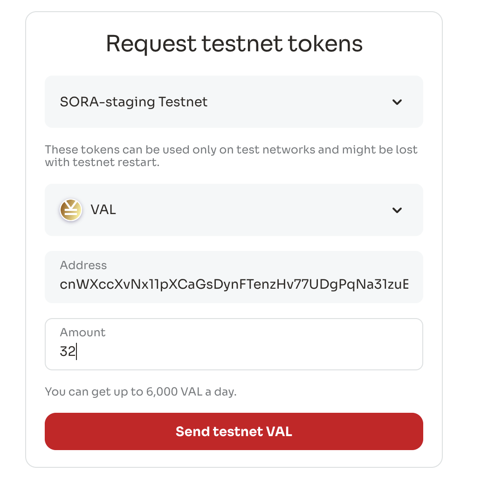
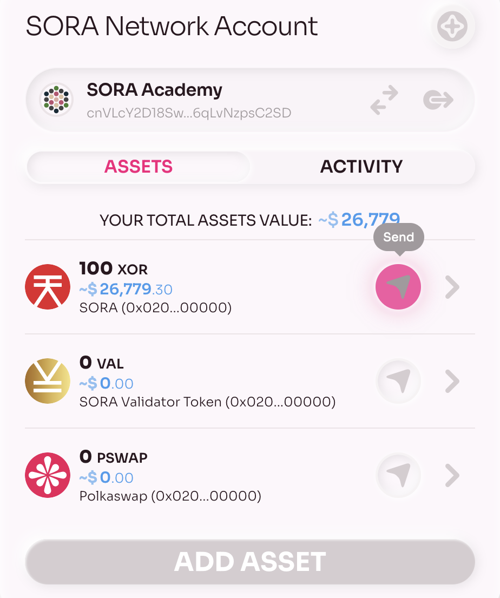
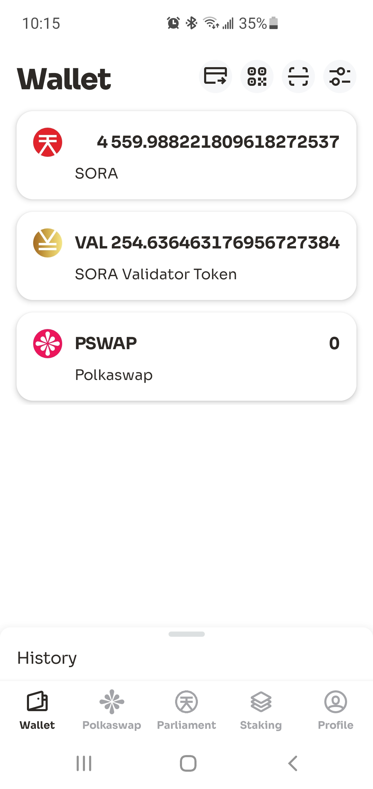
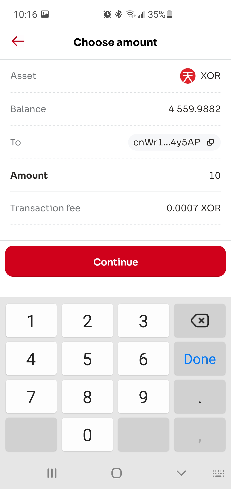
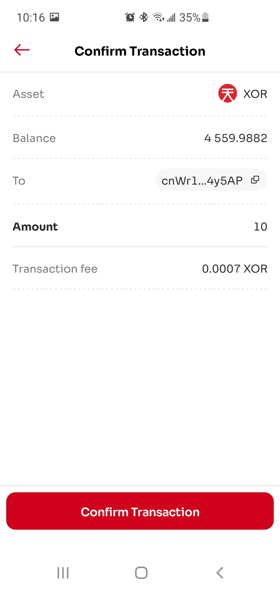
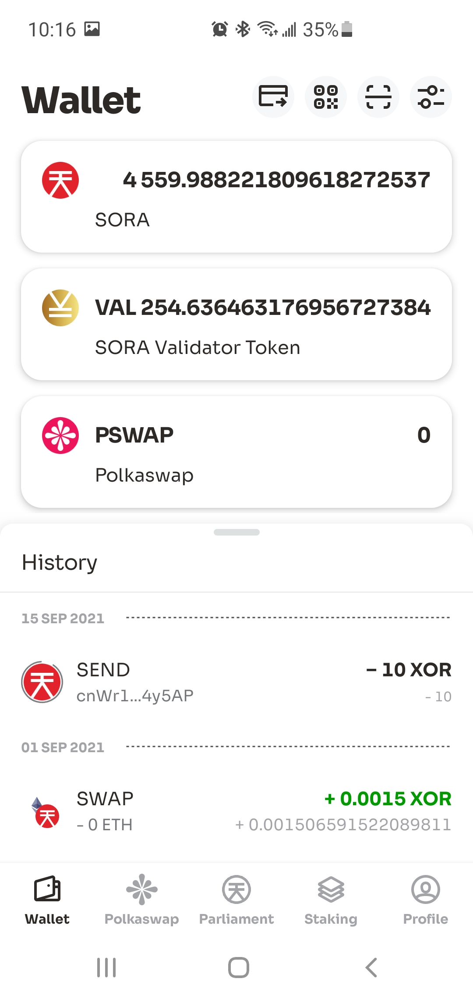
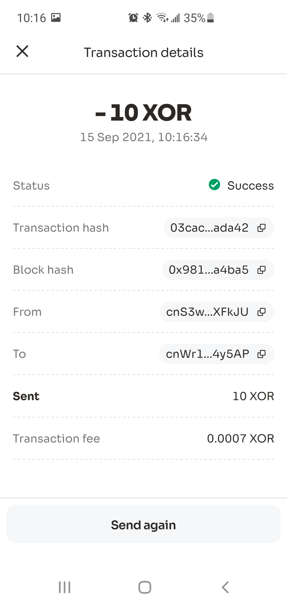
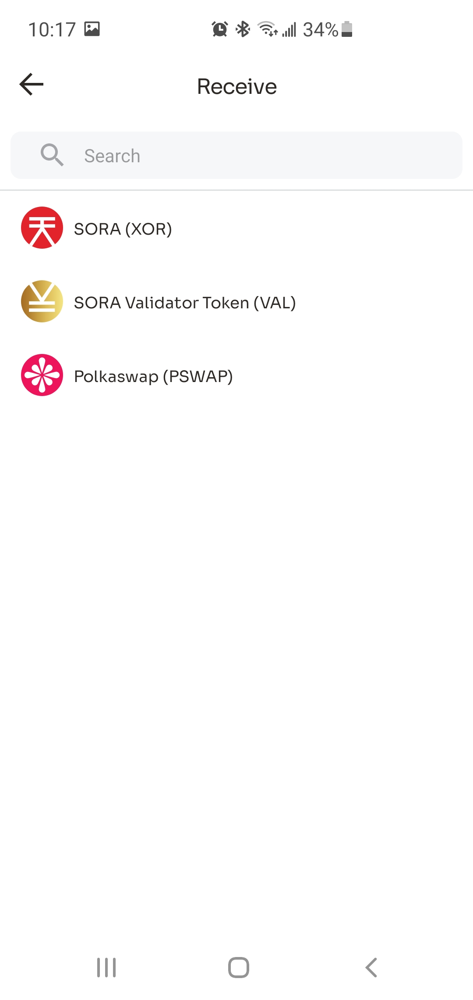
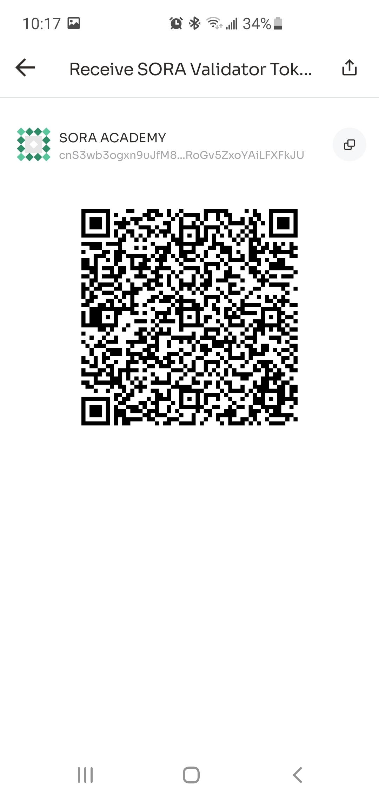

# Transfer

Transfers are used to send tokens from one account to another. You can make transfers using Polkadot.js apps, Polkaswap, and the SORA mobile application.

The transfer logic is implemented in the `assets` pallet. SORA supports multiple assets and every asset can be transferred.

Transferring is a transaction so the network fee must be paid. The fee is calculated in XOR so even if you transfer VAL, PSWAP, or any other token you should have some XOR to cover the fee. The transfer fee in SORA is **0.07 XOR**.

## Practice

::: tip
We recommend using the SORA testnet for practice exercises. Here are the Testnet links:

1. [Polkaswap test application](https://test.polkaswap.io/)
2. [Polkadot js SORA testnet application](https://polkadot.js.org/apps/?rpc=wss%3A%2F%2Fws.stage.sora2.soramitsu.co.jp#/explorer)
3. [Android testnet application](https://play.google.com/store/apps/details?id=jp.co.soramitsu.sora.communitytesting&hl=en&gl=US)
4. [iOS testnet application](https://testflight.apple.com/join/670hF438)
   :::

<iframe width="560" height="315" src="https://www.youtube.com/embed/RdJ6yFFl06k" title="YouTube video player" frameborder="0" allow="accelerometer; autoplay; clipboard-write; encrypted-media; gyroscope; picture-in-picture; web-share" allowfullscreen></iframe>

### Getting Test Tokens

You can practice with transfers using test tokens in the SORA testnet.

1. Open the [faucet](https://testfaucet.polkaswap.io/)

2. Enter your SORA address, select the token, and the number of tokens you need.

3. Click **Send testnet VAL (XOR, PSWAP).**

::: info
Keep in mind that every transaction in SORA requires a fee in XOR. Transferring is a transaction so don't forget to request a few XORs from the faucet.
:::

### Send Tokens

#### Via Polkaswap

The Polkaswap web application has a wallet that you can use for sending tokens.

1. Open the **Account** section and click on send icon (an arrow near the asset)

2. Enter the recipient address and amount of tokens that you'd like to send

   

   If you enter an address that does not start with `cn`, then you'll see a notification about address conversion. <!-- (as mentioned in the Account prefix section of [Accounts in SORA](/accounts-in-sora.md#converting-the-address-format)). -->

   

3. Click Send and confirm the transaction.

4. After the transaction confirmation from the Polkadot.js extension appears, enter your password and confirm the transaction:

::: tip

You can then find your transaction on the Activity tab:

:::

#### Via Mobile Application

The SORA mobile application provides a good UX for sending and receiving tokens.

1. Open the wallet screen and tap the send icon in the top right corner.

2. Select the token to sent:

3. Enter the recipient's address:

4. Enter the amount of tokens to send:

 

5. Confirm the transaction:

You'll be redirected to the Wallet screen:

::: tip

Tap on the transaction in history to view the details:

:::

##### Sending Tokens Using a QR Code

Using QR code reduces the number of mistakes and simplifies the process of entering addresses and tokens. Token information and address are encoded within the QR code, and the application decodes it.

1. Tap on the Scan icon on the top right corner and allow access to the camera.

2. Scan the QR code and then enter the amount of tokens that you'd like to send.

<!-- Probably not needed 

 -->

#### Receiving Tokens Using a QR Code

If you'd like to get tokens using a QR code:

1. Tap the QR icon on the top right corner of the wallet screen:

2. Select the asset:

3. Share the generated QR using the share icon or by copying the image:

