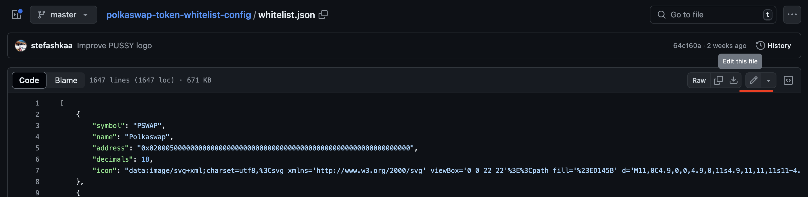
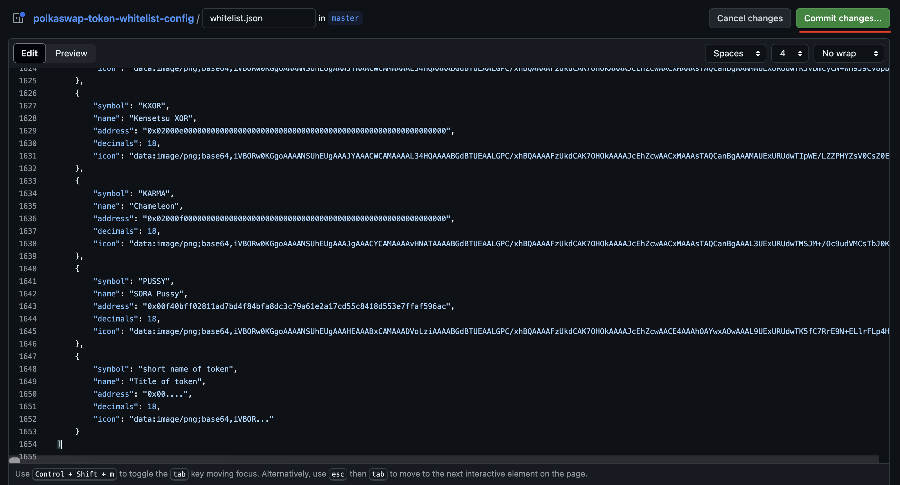
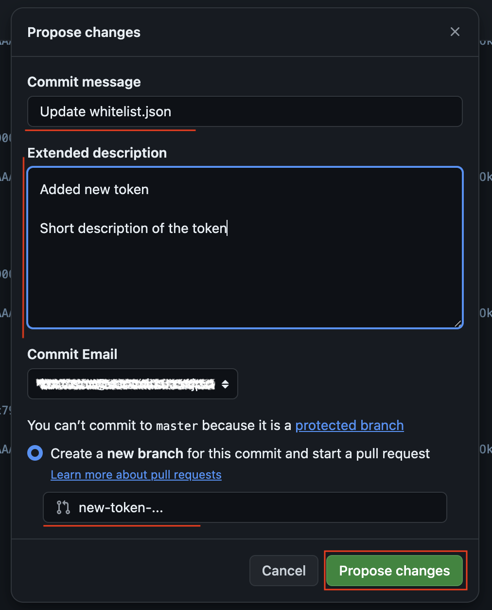

# Whitelist a Token on Polkaswap

Adding tokens to Polkaswap allows users to benefit from all the features of a next-generation, cross-chain liquidity aggregator DEX protocol based on Polkadot, with Parachains and bridges to connect other blockchains.

Whitelisting a token on Polkaswap involves the following steps:

1. [Open Polkaswap whitelist](#open-polkaswap-whitelist)
2. [Clone the repository](#clone-the-repository)
3. [Add the necessary information](#add-the-necessary-information)
4. [Create PR request](#create-pr-request)
5. [Answer the questions and wait for approval](#answer-the-questions-and-wait-for-approval)

## Open Polkaswap whitelist

Open the file [`whitelist.json`](https://github.com/sora-xor/polkaswap-token-whitelist-config/blob/master/whitelist.json) on GitHub

## Clone the repository

Clone the repository to make changes to `whitelist.json` locally on your computer.

Additionally, you can do it via the GitHub interface:

1. On the right side of the interface click on the button _"Edit this file"_ with the pen icon.

2. Add the information about your token on the new screen in edit mode. Look at the next point for the required information.

## Add the necessary information

When editing `whitelist.json`, please add the following necessary information:

- `symbol`: the symbol of the token, the short name of the token. For example, `VAL`.
- `name`: full name of the token. For example, `SORA Validator Token`.
- `address`: SORA asset ID in the `0x...` format.
- `decimals`: number of numbers on the right from the decimal point. It can be only 18 for now.
- `icon`: icon of the token in SVG format.

## Create PR request

After adding all the necessary information, you need to create a PR into this repository by adding lines to the file, representing your token.

You can also do it via the GitHub interface.

1. In the edit mode on the right side you need to find the button `Commit changes..` and click on it.

2. Please provide the following information in the pop-up:
   1. Commit message - a short description of your token.
   2. Extended description - full description of your token and the reason to add to Polkaswap.
   3. Name of the branch - due to you not being able to commit to master for security reasons, GitHub will automatically create a new branch for your changes and token, and you need to provide the name of the branch. It can be the action "add-new-token", or the name of the new token "new-token". Very importantly the name of the branch cannot contain space ' ', only this sign "-".

Once this is done, the community will review your pull request.

## Answer the questions and wait for approval

Pay attention to notifications from your pull request. The community may have questions, and you should resolve them as soon as possible.
