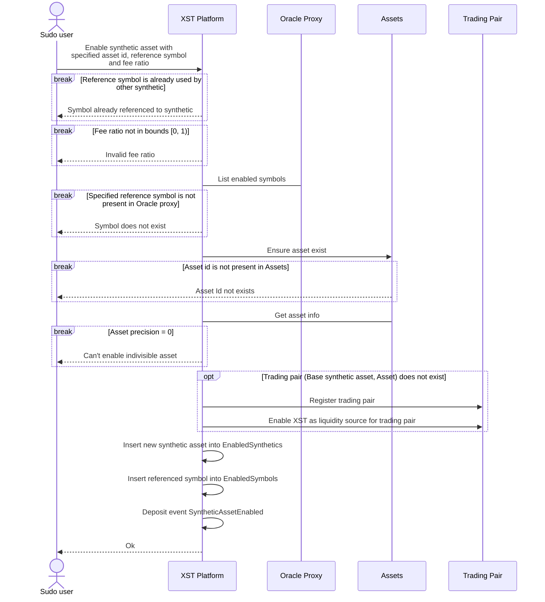
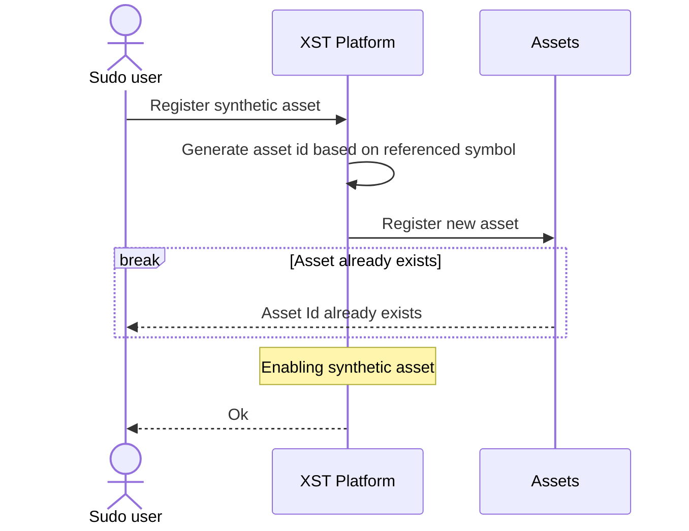
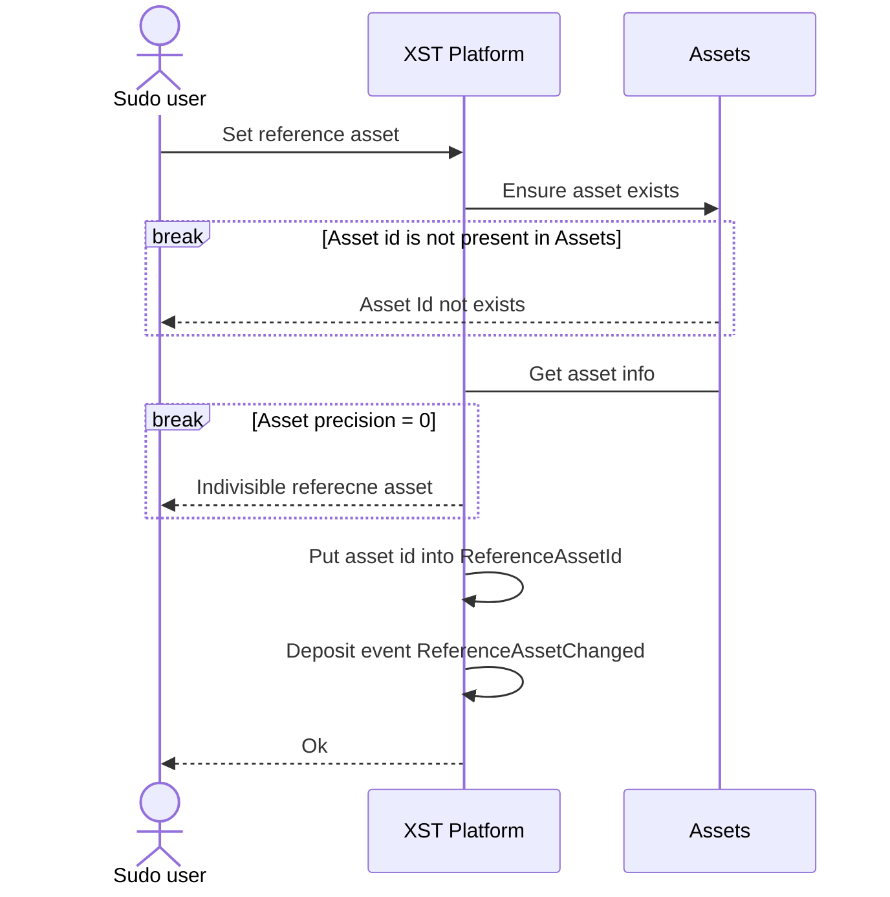
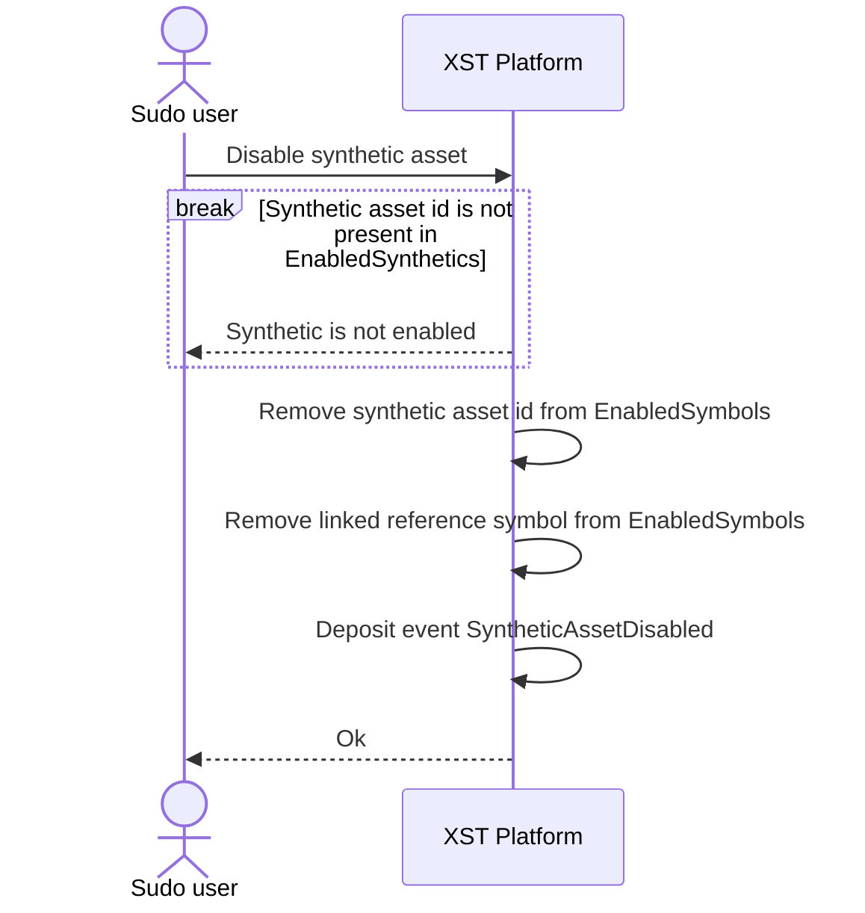
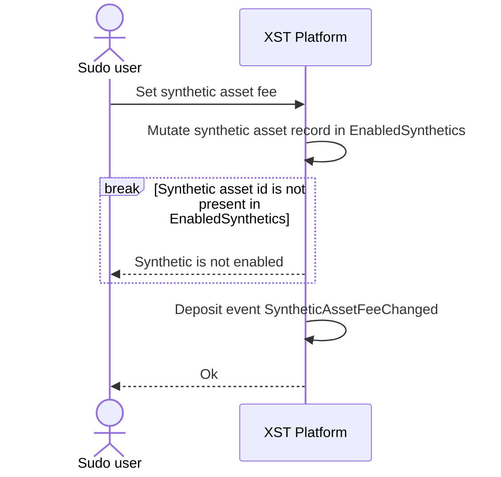
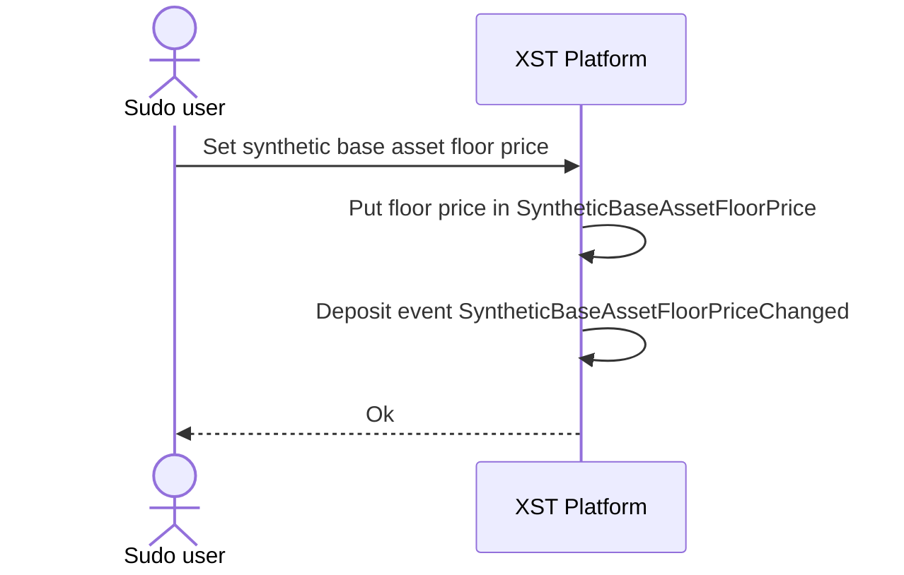
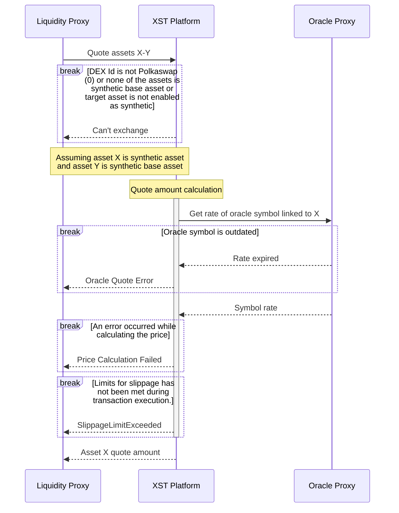
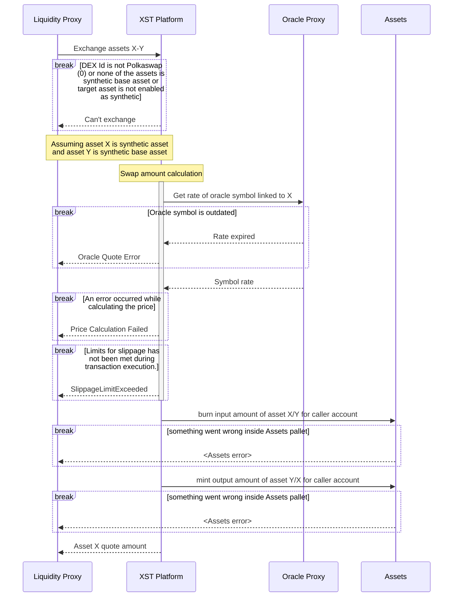

---
head:
  - - link
    - rel: stylesheet
      href: https://cdnjs.cloudflare.com/ajax/libs/KaTeX/0.5.1/katex.min.css
---
# XST Platform 
## Internal logic
### Extrinsics
#### Enabling synthetic asset

#### Registring new synthetic asset

#### Setting reference asset

#### Disabling synthetic asset

#### Setting synthetic asset fee

#### Setting synthetic base asset floor price

### LiquiditySource trait implementation
#### Quoting synthetic asset

#### Exchanging synthetic asset

## Quote/swap amount calculation process
### Notation
$S_f$ - Fee ratio associated with the selected synthetic asset

$S_o$ - Rate of the oracle symbol associated with the selected synthetic asset

$B_p^b$ - Reference buy price of the base synthetic asset in reference asset units

$B_p^s$ - Reference sell price of the base synthetic asset in reference asset units

$\overline{R_p^b}$ - Reference buy price of the reference asset in XOR units

$\overline{R_p^s}$ - Reference sell price of the reference asset in XOR units

$O$ - output amount

$I$ - input amount

$F_{XOR}$ - fee amount in XOR
<!--  -->
### PriceTools price calculation
Before delving into how quote and swap amounts are calculated, it's crucial to understand how the price of a synthetic base asset is calculated in reference units.

The PriceTools pallet stores two distinct average prices for each asset found in the XYK Pool. These averages are recalculated every block in relation to their previous values, ensuring their difference doesn't exceed certain lower and upper ratio bounds. Two values are stored because there are two scenarios: one could **buy** XOR with some asset or **sell** XOR for some asset. The capping lower and upper ratio bounds differ in each scenario, introducing asymmetry. The lower ratio bound in buy cases equals the upper ratio bound in the sell case, and vice versa.

If one is buying the synthetic base asset, its price is calculated as follows:

$B_p^b = \frac{\overline{R_p^b}}{\overline{B_p^s}}$

This equation calculates the price one would get by swapping the reference asset to XOR (i.e., **buying** XOR) and then buying the synthetic base asset with XOR (i.e., **selling** XOR).
The sell price of the synthetic base asset is calculated as follows:

$B_p^s = \frac{\overline{R_p^s}}{\overline{B_p^b}}$

### Synthetic base floor price
If the calculated price of synhtetic base asset exceeds the limit in `SyntheticBaseAssetFloorPrice`, then the price is set to this limit.
### Sell case (Selling synthetic base to some synthetic asset)
#### With desired input
$O = \frac{(I - I\times S_f)\times B_p^s}{S_o}$

Since the fee is calculated in XST and should be paid in XOR, we need to convert it 

$F_{XOR} = \frac{I\times S_f}{\overline{B_p^s}}$
#### With desired output
$I = \frac{O \times S_o}{B_p^s} \times \frac{1}{1 - S_f}$

$F_{XOR} = \left (I - \frac{O \times S_o}{B_p^s} \right ) \times \frac{1}{\overline{B_p^s}}$
### Buy case (Buying synthetic base with some synthetic asset)
#### With desired input
$O = \frac{I \times S_o}{B_p^b} \times (1 - S_f)$

$F_{XOR} = \frac{I \times S_o}{B_p^b} \times S_f \times \frac{1}{\overline{B_p^s}}$
#### With desired output
$O_{w/\ fee} = \frac{O}{1 - S_f}$

$I = \frac{O_{w/\ fee} \times B_p^b}{S_o}$

$F_{XOR} = \frac{O_{w/\ fee} - O}{\overline{B_p^s}}$
